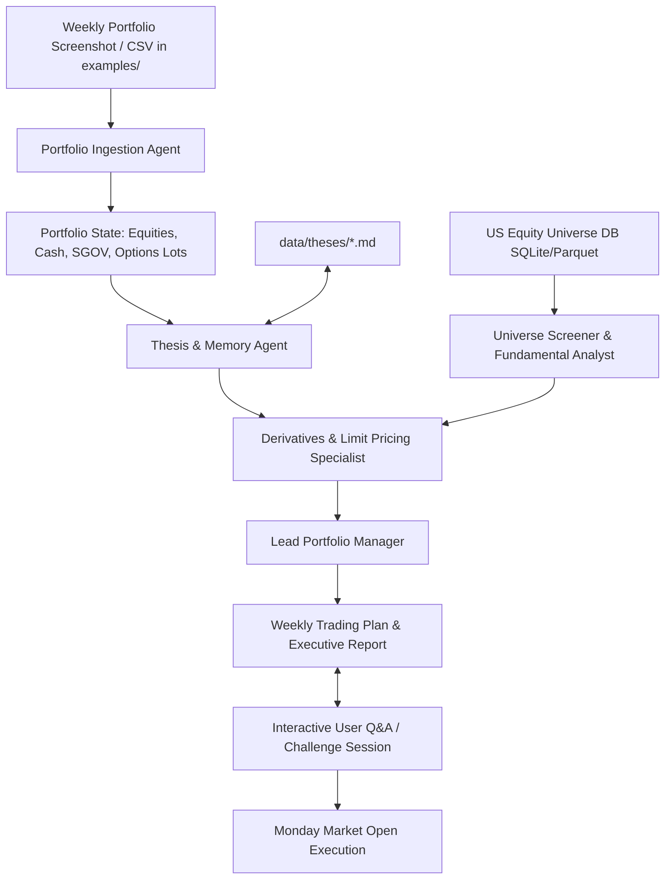

# Agentic Investment Advisor & Context Provider

An intelligent, multi-agent investment advisory system engineered to overcome the limitations of standard chatbots. By maintaining full context over the entire US public equity universe, parsing weekly portfolio snapshots, managing persistent investment thesis memory, and mathematically modeling options strategies, this system empowers AI agent teams to deliver institutional-grade, actionable investment plans.

## The Problem & Vision

### The Problem with Standard AI Chatbots
- **Evasive Disclaimers & Refusals:** When asked for specific portfolio decisions, generic AI models balk, refuse to give actionable advice, or default to generic suggestions (e.g., "buy an S&P 500 index fund").
- **Universe Blindness:** When pushed for stock recommendations, chatbots evaluate only a handful of mega-cap tickers because they lack structured access to the full universe of exchange-traded equities.
- **Amnesia & Broken Context:** Chatbots forget *why* a stock was previously purchased, whether an earnings report invalidated the original thesis, or what price target was set.
- **Options Incompetence:** Standard models cannot reliably construct multi-leg derivative strategies, calculate weekend limit prices, or enforce strict risk constraints like cash-secured puts and covered calls.

### The Solution
This repository serves as a **rich context provider, memory layer, and analytical engine** for a specialized team of AI agents. It equips them with:
1. **Full US Equity Universe Context:** Reliable historical pricing, fundamental data, and screening capabilities across thousands of public companies.
2. **Weekly Portfolio Extraction:** Ingestion of portfolio screenshots or CSV exports from `examples/` (kept private and git-ignored).
3. **Persistent Investment Thesis Memory:** Markdown dossiers tracking every holding's catalysts, target price, expected annualized ROI, and invalidation triggers.
4. **Weekend Options Theoretical Modeling:** Black-Scholes and volatility modeling to set accurate Monday morning limit orders for Cash-Secured Puts (CSPs), Covered Calls (CCs), and option rolls.
5. **Interactive Deliberation & Q&A:** A structured framework for the user to challenge, interrogate, and refine the AI's weekly trading plan.

## Core Portfolio Rules & Safety Constraints

The system strictly adheres to non-negotiable risk rules:

| Rule | Constraint | Details |
| :--- | :--- | :--- |
| **Asset Universe** | US Public Equities | Companies listed on US exchanges (NYSE, NASDAQ, AMEX), including US-listed ADRs. No mutual funds or broad ETFs. |
| **Cash Proxy** | `SGOV` Only | `SGOV` (iShares 0-3 Month Treasury Bond ETF) is the **sole** allowed ETF, used to park idle cash at risk-free yields when awaiting opportunities. |
| **Derivatives** | CSPs & CCs Only | **Strictly NO naked options.** All puts must be 100% cash-secured. All calls must be 100% covered by $\ge 100$ shares of underlying stock. |
| **Rolling** | Defensive & Income | Option rolls permitted (rolling out/down for puts, rolling out/up for calls) to defend positions or extend yield. |
| **Concentration** | $\le 25$ Positions | Maximum ~25 high-conviction holdings to maintain portfolio clarity and depth of research. |
| **Trade Frequency** | Weekly or Less | Analysis conducted over the weekend; limit orders placed for execution on Monday market open. |


## Multi-Agent Team Architecture

The system coordinates a team of specialized agent roles:



1. **Portfolio Ingestion Agent:** Parses uploaded screenshots or CSV files into clean textual holdings (symbols, share counts, cash, `SGOV`, and open options). Identifies covered call eligibility ($\ge 100$ shares).
2. **Thesis & Memory Agent:** Loads markdown dossiers from `data/theses/`, verifies if active catalysts materialized or failed (e.g., negative earnings, regulatory delays), and flags broken theses for exit.
3. **Universe Screener & Fundamental Analyst:** Screens the broader US equity database against fundamental and technical criteria, identifying high-conviction ideas while respecting the $\le 25$ position ceiling.
4. **Derivatives & Limit Pricing Specialist:** Models options pricing (Black-Scholes / IV estimation) over the weekend to compute precise Monday limit orders for Cash-Secured Puts, Covered Calls, and Rolls.
5. **Lead Portfolio Manager:** Synthesizes the sub-agents' findings into a unified **Weekly Trading Plan & Executive Report**, and leads the interactive Q&A discussion.

## Weekly Operating Workflow

```
[Friday Close / Weekend]
  1. Upload portfolio screenshot or CSV into examples/
  2. Run the weekly agent deliberation prompt
  3. Review the Executive Report & Weekly Trading Plan
  4. Interrogate the agents via Interactive Q&A (challenge targets, theses, and limit prices)
  
[Monday 9:30 AM ET]
  5. Place generated Limit Orders at market open
```

## Repository Structure

```
investments/
├── README.md                           # System overview & operational guide (this file)
├── ROADMAP.md                          # Phase-by-phase implementation plan
├── CHANGELOG.md                        # Version and architecture change history
├── docs/                               # Detailed system specifications & guides
│   ├── architecture.md                 # Multi-agent system architecture & pipeline
│   ├── portfolio-constraints.md        # Formal investment rules & risk parameters
│   ├── investment-thesis-and-memory.md # Markdown thesis dossier schema & lifecycle
│   ├── option-pricing-and-strategies.md# Options theoretical modeling & weekend limit rules
│   ├── data-sources-and-universe.md    # US equity universe management & free public APIs
│   ├── weekly-workflow-and-prompting.md# Weekly runbook, prompt templates & Q&A protocol
│   └── empirical-research-and-calibration.md # Quantitative research synthesis & fill tracking
├── data/
│   ├── theses/                         # Persistent markdown dossiers for each position
│   │   └── EXAMPLE_THESIS.md           # Starter thesis template
│   └── universe.db                     # (Optional) Local SQLite/Parquet US stock database
├── examples/                           # User-uploaded weekly screenshots & CSVs (.gitignore'd)
└── scripts/                            # Deterministic data ingestion & pricing helper scripts
```

## Getting Started

1. **Explore the Documentation:**
   - Read the [Portfolio Constraints](file:///c:/Users/fyhor/Documents/GitHub/investments/docs/portfolio-constraints.md) to understand non-negotiable boundaries.
   - Review [Investment Thesis & Memory](file:///c:/Users/fyhor/Documents/GitHub/investments/docs/investment-thesis-and-memory.md) to see how position memory is preserved.
   - Check the [Weekly Workflow & Prompting Guide](file:///c:/Users/fyhor/Documents/GitHub/investments/docs/weekly-workflow-and-prompting.md) for ready-to-use agent prompts.

2. **Set Up Your Portfolio Snapshot:**
   - Drop your weekend portfolio screenshot (or CSV export) into the `examples/` directory.

3. **Prompt the Agent Team:**
   - Copy the master prompt template from [weekly-workflow-and-prompting.md](file:///c:/Users/fyhor/Documents/GitHub/investments/docs/weekly-workflow-and-prompting.md) into your AI session to generate your Monday Trading Plan.