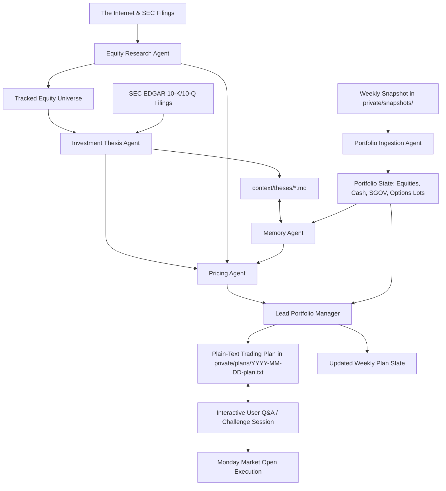

# Agentic Investment Advisor & Context Provider

The goal of this repo is to create an intelligent, multi-agent investment advisory system engineered to overcome the limitations of standard chatbots to achieve at least a 20% annualized return over 20 years for a portfolio of public companies whose shares trade on an exchange in the United States. By maintaining full context over the entire US public equity universe, parsing weekly portfolio snapshots, managing persistent investment thesis memory, and mathematically modeling options strategies, this system empowers AI agent teams to deliver institutional-grade, actionable investment plans.

## Disclaimer: Use at Your Own Risk

This repository is strictly for educational, informational, and research purposes. It does not constitute financial, investment, legal, or tax advice. Investing in equities and options involves substantial risk of capital loss. Read the full [DISCLAIMER.md](DISCLAIMER.md) before using this system.

## Audience-First Repository Structure

This repository separates data, documentation, and logic cleanly according to its primary consumer:

```
investments/
  context/              # Primary audience: AI Agents (Markdown context, prompts, memory schemas, strategy constraints)
    data/               # Complete structured datasets for AI agents (universe.json, market_prices.json, sec_reports.json, equities/)
    theses/             # Markdown investment dossiers and catalyst logs for all 144 equities (agent memory)
    prompts/            # Agent role prompts and weekly deliberation protocols
    sources/            # Authoritative data sources catalog and access methodologies
    research/           # Errata log, verification records, and quantitative research
    schemas/            # Schema definitions (portfolio context, data provenance, errata)
    strategy/           # Factor models, empirical parameters, strategy rules
  http/                 # Primary audience: Humans (Public Web Interface & Companion Dashboard)
    index.html          # Web root entry point (discoverable documentation & dashboard)
    docs/               # Human-facing documentation (HTML / interactive guides)
      index.html        # Documentation hub
      architecture.html # System architecture & multi-agent pipeline
      sources.html      # Data sources catalog, provenance, & verification protocols
      strategies.html   # Investment strategy & portfolio constraints
      options.html      # Options pricing & weekend limit order modeling
      valuation.html    # Valuation methodologies & financial models
      workflow.html     # Weekly deliberation & executive planning workflow
    data/               # Public company data and JSON fixtures for the web interface
    css/                # Styling and typography (app.css, docs.css, roboto-fonts.css)
    js/                 # Vue 3 no-build ESM components and services
  scripts/              # Deterministic CLI tools (data sync, Black-Scholes pricing, SEC fetchers)
    data/               # Local script databases and caches (e.g., universe.db)
  private/              # Primary audience: Humans (Private Data - Git Ignored)
    snapshots/          # Raw weekly inputs (brokerage CSVs, screenshots)
    plans/              # Generated weekly trading plans (Plain ASCII text .txt)
  scratch/              # Local Sandbox for Humans & Agents (Git Ignored)
  examples/             # Public onboarding templates (sample portfolio CSV, sample plan .txt)
```

## Core Portfolio Rules & Safety Constraints

The system strictly adheres to non-negotiable risk rules:

| Rule | Constraint | Details |
| :--- | :--- | :--- |
| **Asset Universe** | US Public Equities | Companies listed on US exchanges (NYSE, NASDAQ, AMEX), including US-listed ADRs. No mutual funds or broad ETFs. |
| **Cash Proxy** | `SGOV` Only | `SGOV` (iShares 0-3 Month Treasury Bond ETF) is the sole allowed ETF, used to park idle cash at risk-free yields when awaiting opportunities. |
| **Derivatives** | CSPs & CCs Only | Strictly NO naked options. All puts must be 100% cash-secured. All calls must be 100% covered by at least 100 shares of underlying stock. |
| **Rolling** | Defensive & Income | Option rolls permitted (rolling out/down for puts, rolling out/up for calls) strictly for a net credit. |
| **Concentration** | ~25 Positions Target | Soft guideline aiming for 25 or fewer holdings. Conviction dictates sizing: can range from a single high-conviction 100% holding to 26+ positions. |
| **Trade Frequency** | Weekly Cadence | Analysis conducted over the weekend; limit orders placed for execution on Monday market open (9:30 AM ET). |

## Multi-Agent Team Architecture

The system coordinates a team of specialized agent roles:



1. **Portfolio Ingestion Agent:** Parses uploaded screenshots or CSV files in `private/snapshots/` into clean textual holdings (symbols, share counts, cash, `SGOV`, and open options) while maintaining strict multi-portfolio isolation. Identifies covered call eligibility (100 or more shares).
2. **Equity Research Agent:** Proactively searches the Internet and US public exchanges (NYSE, NASDAQ, AMEX) using tools to discover compelling companies, evaluates solvency/runway, and screens for high probability of achieving >= 20% annualized ROI to onboard into our universe.
3. **Investment Thesis Agent:** Synthesizes SEC EDGAR 10-K/10-Q filings, earnings releases, and industry trends to author institutional 3-year quantitative forecasts (13-quarter revenue path, 6-horizon shares outstanding, 4-horizon price target ranges), dual Revenue and P/S narratives, and assigns decisive `BUY`, `HOLD`, `SELL`, or `AVOID` ratings.
4. **Memory Agent:** Manages institutional memory across runs in `context/`, audits catalyst milestones against quarterly results, monitors explicit invalidation exit triggers, maintains the errata log, and issues urgent liquidation alerts for broken theses.
5. **Pricing Agent:** Predicts price trends to calculate technical limit order prices for common stocks, models Black-Scholes options pricing for Cash-Secured Puts (0.15-0.30 Delta) and Covered Calls (0.20-0.35 Delta), and verifies net-credit rolls.
6. **Lead Portfolio Manager:** Synthesizes the sub-agents' findings into a personalized **Weekly Trading Plan** (plain ASCII text saved to `private/plans/YYYY-MM-DD-plan.txt`) and coordinates single-session Monday execution.

## Weekly Operating Workflow

```
[Friday Close / Weekend]
  1. Upload portfolio screenshot or CSV into private/snapshots/
  2. Run the weekly agent deliberation prompt (context/prompts/weekly_deliberation.md)
  3. Review the plain-text Trading Plan saved in private/plans/YYYY-MM-DD-plan.txt
  4. Interrogate the agents via Interactive Q&A (challenge targets, theses, and limit prices)
  
[Monday 9:30 AM ET]
  5. Place generated Limit Orders at market open in a single session
```

## Running the Documentation & Universe Explorer

To browse the company universe, investment theses, and human-facing documentation locally:

```bash
# Start a lightweight local static web server serving http/
python -m http.server -d http 8080
```

Then open `http://localhost:8080` in your web browser:
- **[Public Equities Intelligence & SEC Provenance](http/stocks.html):** Explore all 144 tracked US equities, filter by sector/status, view multi-view dossiers and dense tables, and audit primary source SEC EDGAR 10-K/10-Q filings.
- **[Documentation Hub](http/docs/index.html):** Read architectural guides, options math, data provenance hierarchy, and deliberation protocols.

## Getting Started

1. **Explore the Public Intelligence & Documentation:**
   - Browse [Public Equities Intelligence](http/stocks.html).
   - Read the [Documentation Hub](http/docs/index.html) or [Architecture Guide](http/docs/architecture.html).
   - Review [Portfolio Constraints](http/docs/strategies.html) to understand non-negotiable boundaries.
   - Inspect [examples/](examples/README.md) to see synthetic inputs and output formats.

2. **Set Up Your Private Portfolio Snapshot:**
   - Drop your weekend portfolio screenshot (or CSV export) into the `private/snapshots/` directory.

3. **Prompt the Agent Team:**
   - Copy the master prompt template from [weekly_deliberation.md](context/prompts/weekly_deliberation.md) into your AI session to generate your Monday Trading Plan in `private/plans/YYYY-MM-DD-plan.txt`.