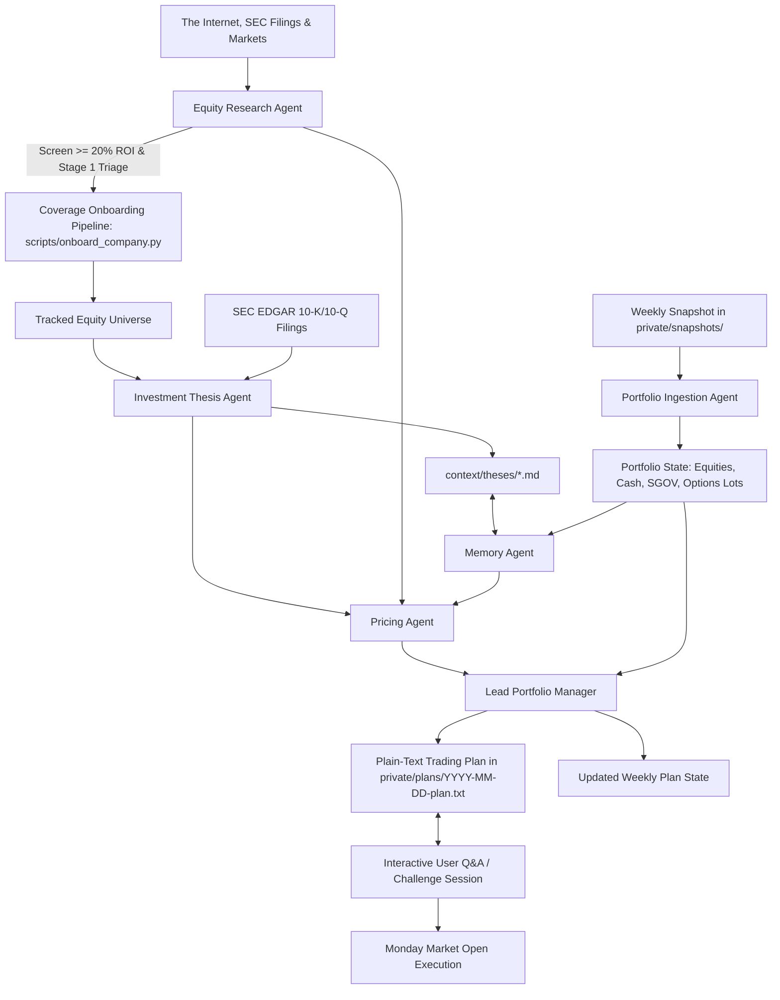

# Agentic Investment Advisor & Context Provider

The goal of this repo is to create an intelligent, multi-agent investment advisory system engineered to overcome the limitations of standard chatbots to achieve at least a 20% annualized return over 20 years for a portfolio of public companies whose shares trade on an exchange in the United States. By maintaining full context over the entire US public equity universe, parsing weekly portfolio snapshots, managing persistent investment thesis memory, and mathematically modeling options strategies, this system empowers AI agent teams to deliver institutional-grade, actionable investment plans.

## Disclaimer: Use at Your Own Risk

This repository is strictly for educational, informational, and research purposes. It does not constitute financial, investment, legal, or tax advice. Investing in equities and options involves substantial risk of capital loss. Read the full [DISCLAIMER.md](DISCLAIMER.md) before using this system.

## Audience-First Repository Structure

This repository separates data, documentation, and logic cleanly according to its primary consumer:

```
investments/
  context/              # Primary audience: AI Agents (Markdown context, prompts, memory schemas, strategy constraints)
    data/               # Complete structured datasets for AI agents (universe.json, market_prices.json, sec_reports.json, equities/)
    theses/             # Markdown investment dossiers and catalyst logs for all universe equities (agent memory)
    prompts/            # Agent role prompts, weekly deliberation, and universe onboarding protocols
    sources/            # Authoritative data sources catalog and access methodologies
    research/           # Errata log, verification records, and quantitative research
    schemas/            # Schema definitions (portfolio context, data provenance, errata)
    strategy/           # Factor models, empirical parameters, strategy rules
  http/                 # Primary audience: Humans (Public Web Interface & Companion Dashboard)
    index.html          # Web root entry point (discoverable documentation & dashboard)
    docs/               # Human-facing documentation (HTML / interactive guides)
      index.html        # Documentation hub
      architecture.html # System architecture & multi-agent pipeline
      sources.html      # Data sources catalog, provenance, & verification protocols
      strategies.html   # Investment strategy & portfolio constraints
      options.html      # Options pricing & weekend limit order modeling
      valuation.html    # Valuation methodologies & financial models
      workflow.html     # System workflows: weekly deliberation & universe onboarding
    data/               # Public company data and JSON fixtures for the web interface
    css/                # Styling and typography (app.css, docs.css, roboto-fonts.css)
    js/                 # Vue 3 no-build ESM components and services
  scripts/              # Deterministic CLI tools (data sync, Black-Scholes pricing, SEC fetchers, company onboarding)
    data/               # Local script databases and caches (e.g., universe.db)
  private/              # Primary audience: Humans (Private Data - Git Ignored)
    snapshots/          # Raw weekly inputs (brokerage CSVs, screenshots)
    plans/              # Generated weekly trading plans (Plain ASCII text .txt)
  scratch/              # Local Sandbox for Humans & Agents (Git Ignored)
  examples/             # Public onboarding templates (sample portfolio CSV, sample plan .txt)
```

## Core Portfolio Rules & Safety Constraints

The system strictly adheres to non-negotiable risk rules:

| Rule | Constraint | Details |
| :--- | :--- | :--- |
| **Asset Universe** | US Public Equities | Companies listed on US exchanges (NYSE, NASDAQ, AMEX), including US-listed ADRs. No mutual funds or broad ETFs. |
| **Cash Proxy** | `SGOV` Only | `SGOV` (iShares 0-3 Month Treasury Bond ETF) is the sole allowed ETF, used to park idle cash at risk-free yields when awaiting opportunities. |
| **Derivatives** | CSPs, CCs & BTC | Strictly NO naked options and NO long speculative options. Puts are 100% cash-secured; calls are 100% share-covered. Buying to close (BTC) short puts or calls on losing propositions is permitted and enforced for downside defense. |
| **Rolling & Closing** | Credit Rolls & BTC Exits | Option rolls permitted strictly for a net credit. Immediate Buy to Close (BTC) executed for short puts (to avert assignment on falling stocks) or short calls (to unlock shares for sale) on broken theses. |
| **Concentration** | ~25 Positions Target | Soft guideline aiming for 25 or fewer holdings. Conviction dictates sizing: can range from a single high-conviction 100% holding to 26+ positions. |
| **Trade Frequency** | Weekly Cadence | Analysis conducted over the weekend; limit orders placed for execution on Monday market open (9:30 AM ET). |

## Multi-Agent Team Architecture

The system coordinates a team of specialized agent roles:



1. **Portfolio Ingestion Agent:** Parses uploaded screenshots or CSV files in `private/snapshots/` into clean textual holdings (symbols, share counts, cash, `SGOV`, and open options) while maintaining strict multi-portfolio isolation. Identifies covered call eligibility (100 or more shares).
2. **Equity Research Agent:** Proactively searches the Internet and US public exchanges (NYSE, NASDAQ, AMEX) using tools to discover compelling companies, evaluates solvency/runway, and screens for high probability of achieving >= 20% annualized ROI to onboard single or batch equities into our universe on demand.
3. **Investment Thesis Agent:** Synthesizes SEC EDGAR 10-K/10-Q filings, earnings releases, and industry trends to author institutional 3-year quantitative forecasts (13-quarter revenue path, 6-horizon shares outstanding, 4-horizon price target ranges), dual Revenue and P/S narratives, and assigns decisive `BUY`, `HOLD`, `SELL`, or `AVOID` ratings.
4. **Memory Agent:** Manages institutional memory across runs in `context/`, audits catalyst milestones against quarterly results, monitors explicit invalidation exit triggers, maintains the errata log, and issues urgent liquidation alerts for broken theses (including BUY TO CLOSE mandates on open derivatives).
5. **Pricing Agent:** Predicts price trends to calculate technical limit order prices for common stocks, models Black-Scholes options pricing for Cash-Secured Puts (0.15-0.30 Delta) and Covered Calls (0.20-0.35 Delta), verifies net-credit rolls, and computes Buy to Close (BTC) order pricing on losing propositions.
6. **Lead Portfolio Manager:** Synthesizes the sub-agents' findings into a personalized **Weekly Trading Plan** (plain ASCII text saved to `private/plans/YYYY-MM-DD-plan.txt`) and coordinates single-session Monday execution.

## System Operating Workflows

The system supports two core operating workflows:

### Workflow 1: Weekly Deliberation & Single-Session Order Execution

```
[Friday Close / Weekend]
  1. Upload portfolio screenshot or CSV into private/snapshots/
  2. Run the weekly agent deliberation prompt (context/prompts/weekly_deliberation.md)
  3. Review the plain-text Trading Plan saved in private/plans/YYYY-MM-DD-plan.txt
  4. Interrogate the agents via Interactive Q&A (challenge targets, theses, and limit prices)
  
[Monday 9:30 AM ET]
  5. Place generated Limit Orders at market open in a single session
```

### Workflow 2: Coverage Universe Expansion & Equity Onboarding

```
[On-Demand (Anticipated a few times per year)]
  1. Ask the Equity Research Agent to screen for >= 20% ROI compounders or specify new tickers (e.g. CRWD or NOW, ABNB, NET, MDB)
  2. Execute deterministic onboarding: python scripts/onboard_company.py --symbols <TICKERS> --live
  3. AI agents ingest Tier 1 SEC EDGAR statements, model 13Q revenue paths, and author qualitative dossiers
  4. Master catalogs (universe.json) update and scripts/quality_control.py --audit asserts 0 errors
  5. Newly added equities become immediately available for future weekly deliberation and dashboard tracking
```

## Master Deterministic CLI Tool (`scripts/manage_universe.py`)

The repository provides a single, unified deterministic command-line interface, `scripts/manage_universe.py`, enabling human traders and AI agents to query the equity universe, synchronize market data, refresh regulatory filings, and execute deterministic workflows with 0 LLM token spend.

Run the tool with `--help` to inspect all options:

```bash
python scripts/manage_universe.py --help
```

### 1. Count, Search, Filter & Sort Equities

Query the master universe of US public equities with multi-dimensional filters:

```bash
# Print total count of tracked equities
python scripts/manage_universe.py --count

# Filter for BUY-rated equities targeting >= 20% annualized ROI
python scripts/manage_universe.py list --status BUY --min-roi 20.0

# Filter by sector, sort by target ROI descending, limit to top 10
python scripts/manage_universe.py list --sector Technology --sort-by roi --order desc --limit 10

# Filter for Nasdaq-100 (QQQ) constituents and output symbol list
python scripts/manage_universe.py list --index QQQ --format symbols

# Find equities trading within 15% of their 52-week low
python scripts/manage_universe.py list --near-52w-low 15 --format compact

# Export filtered query results to CSV or JSON
python scripts/manage_universe.py list --min-roi 20.0 --format csv
python scripts/manage_universe.py list --status BUY --format json
```

### 2. Update Market Share Prices (OHLC) & Trading Volume

Synchronize live prices, dual nominal/adjusted historical daily candles, 52-week price channels, SMA 20/50, and daily trading volumes:

```bash
# Ingest live market prices across the entire universe (0 LLM tokens)
python scripts/manage_universe.py update-prices --live

# Refresh specific target tickers during intraday trading
python scripts/manage_universe.py update-prices --symbols NVDA AAPL MSFT TSLA

# Verify cached market prices offline without network requests
python scripts/manage_universe.py update-prices --verify

# Rebuild historical 18-month price archive
python scripts/manage_universe.py update-prices --archive
```

### 3. Refresh SEC Filings & Non-Price Intelligence

Synchronize audited financial statements from SEC EDGAR XBRL APIs and auxiliary non-price datasets:

```bash
# Fetch fresh SEC EDGAR XBRL statements for universe equities
python scripts/manage_universe.py refresh-sec --live

# Refresh SEC data for specific symbols
python scripts/manage_universe.py refresh-sec --symbols NVDA CRM WDAY

# Refresh all non-price datasets (SEC, ETF holdings, analysts, filing calendar, off-balance sheet)
python scripts/manage_universe.py refresh-sec --all

# Rebuild statutory 10-Q/10-K filing deadline calendar
python scripts/manage_universe.py refresh-sec --filings-calendar

# Synchronize QQQ, DIA, and SPY constituent holdings from Form NPORT-P
python scripts/manage_universe.py refresh-sec --etf-holdings

# Refresh sell-side analyst price targets and coverage registry
python scripts/manage_universe.py refresh-sec --analysts
```

### 4. Execute Deterministic System Workflows

Orchestrate quantitative modeling, risk auditing, screening, and snapshot parsing:

```bash
# Run deterministic Quality Control audit to assert 0 errors across datasets
python scripts/manage_universe.py audit

# Screen market for >= 20% annualized ROI compounders passing solvency checks
python scripts/manage_universe.py screen --min-roi 20.0 --limit 10

# Run Stage 1 Lightweight Triage (gross margin >= 15%, debt/equity <= 4.0x, runway >= 12m)
python scripts/manage_universe.py triage --summary

# Model Black-Scholes Cash-Secured Put pricing, Greeks, and AROC
python scripts/manage_universe.py pricing option --stock-price 125.0 --strike 120.0 --dte 35 --type put

# Audit institutional memory, catalyst milestones, and invalidation triggers
python scripts/manage_universe.py memory

# Parse weekly brokerage snapshot export in private/snapshots/
python scripts/manage_universe.py snapshot --demo

# Onboard a new public company into coverage with live SEC facts & pricing
python scripts/manage_universe.py onboard --symbol CRWD --live

# Execute Cadence 6 full ground-truth rebuild across all tiers
python scripts/manage_universe.py rebuild-all
```

## Operational Cadences & Token Economy

The system is engineered for maximum token parsimony, separating deterministic tasks (0 LLM tokens) from focused generative agent reasoning:

| Cadence | Frequency | Primary Tooling | Token Cost | Objective |
| :--- | :--- | :--- | :--- | :--- |
| **Cadence 1: Daily Price Sync** | Daily (Open/Close) | `manage_universe.py update-prices` | 0 Tokens | Refresh live market quotes, trading volume, 52W bounds, and moving averages. |
| **Cadence 2: Weekly Deliberation** | Weekend Single-Session | `weekly_deliberation.md`, `render_plan.py` | ~2K - 5K Tokens | Ingest snapshots, calculate Black-Scholes limit orders, write plain ASCII plan. |
| **Cadence 3: Event Surveillance** | Event-Driven / Daily | `surveil_sentiment.py`, `track_short_sellers.py` | ~500 - 1.5K Tokens | Surveil press releases, Reddit chatter, and 20 top activist short sellers. |
| **Cadence 4: Scheduled SEC Sync** | Scheduled / Monthly | `manage_universe.py refresh-sec` | ~500 Tokens / Stock | Track 10-Q/10-K statutory deadlines and ingest newly filed XBRL statements. |
| **Cadence 5: Universe Expansion** | On-Demand / Periodic | `manage_universe.py onboard`, `screen` | ~10K - 15K Tokens / Stock | Screen 20%+ ROI compounders, ingest SEC XBRL data, author dossiers, update universe. |
| **Cadence 6: Ground-Truth Rebuild** | Rare / On-Demand | `manage_universe.py rebuild-all` | Full Audit Mode | Rebuild entire dataset from primary SEC/exchange sources to eliminate hallucinations. |

Detailed operational playbooks and copy-paste CLI commands are documented in the [User Guide & Operational Cadences](http/guide.html).

## Running the Documentation & Universe Explorer

To browse the company universe, investment theses, operational cadences, and human-facing documentation locally:

```bash
# Start a lightweight local static web server serving http/
python -m http.server -d http 8080
```

Then open `http://localhost:8080` in your web browser:
- **[User Guide & Operational Cadences](http/guide.html):** Complete operational playbooks, token economy matrix, and CLI tool instructions.
- **[System Workflows & Execution Protocols](http/docs/workflow.html):** Deep dive into weekly trading plans and coverage universe expansion.
- **[Public Equities Intelligence & SEC Provenance](http/stocks.html):** Explore tracked US equities, filter by sector/status, view multi-view dossiers, and audit SEC filings.
- **[Documentation Hub](http/docs/index.html):** Read architectural guides, options math, data provenance hierarchy, and deliberation protocols.

## Getting Started

1. **Explore the Public Intelligence & Documentation:**
   - Read the [User Guide & Operational Cadences](http/guide.html).
   - Browse [Public Equities Intelligence](http/stocks.html).
   - Read the [System Workflows Guide](http/docs/workflow.html) and [Documentation Hub](http/docs/index.html).
   - Review [Portfolio Constraints](http/docs/strategies.html) to understand non-negotiable boundaries.
   - Inspect [examples/](examples/README.md) to see synthetic inputs and output formats.

2. **Add Equities to Your Coverage Universe (As Desired):**
   - Prompt the Equity Research Agent using the templates in [onboard_company.md](context/prompts/onboard_company.md) to screen for >= 20% ROI candidates or onboard specific tickers.

3. **Set Up Your Private Portfolio Snapshot:**
   - Drop your weekend portfolio screenshot (or CSV export) into the `private/snapshots/` directory.

4. **Prompt the Agent Team for Weekly Deliberation:**
   - Copy the master prompt template from [weekly_deliberation.md](context/prompts/weekly_deliberation.md) into your AI session to generate your Monday Trading Plan in `private/plans/YYYY-MM-DD-plan.txt`.

## License

This project is licensed under the terms of the GNU General Public License v3.0 (GPLv3). See the [LICENSE](LICENSE) file for the full text.
