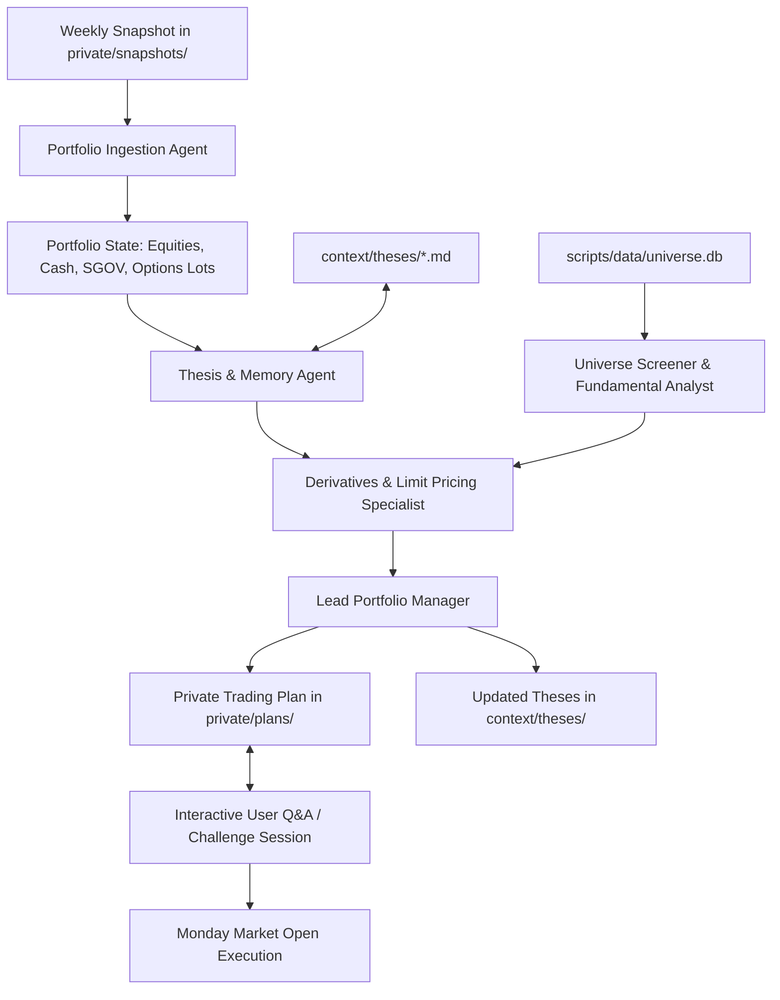

# Agentic Investment Advisor & Context Provider

The goal of this repo is to create an intelligent, multi-agent investment advisory system engineered to overcome the limitations of standard chatbots to achieve at least a 20% annualized return over 20 years for a portfolio of public companies whose shares trade on an exchange in the United States. By maintaining full context over the entire US public equity universe, parsing weekly portfolio snapshots, managing persistent investment thesis memory, and mathematically modeling options strategies, this system empowers AI agent teams to deliver institutional-grade, actionable investment plans.

## Disclaimer: Use at Your Own Risk

This repository is strictly for educational, informational, and research purposes. It does not constitute financial, investment, legal, or tax advice. Investing in equities and options involves substantial risk of capital loss. Read the full [DISCLAIMER.md](DISCLAIMER.md) before using this system.

## Audience-First Repository Structure

This repository separates data, documentation, and logic cleanly according to its primary consumer:

```
investments/
  context/              # Primary audience: AI Agents (Markdown context, prompts, memory schemas, strategy constraints)
    prompts/            # Agent role prompts and weekly deliberation protocols
    theses/             # Markdown investment dossiers and catalyst logs (agent memory)
    schemas/            # Schema definitions (portfolio context, JSON formats)
    strategy/           # Factor models, empirical parameters, strategy rules
  http/                 # Primary audience: Humans (Public Web Interface & Companion Dashboard)
    index.html          # Web root entry point (discoverable documentation & dashboard)
    docs/               # Human-facing documentation (HTML / interactive guides)
      index.html        # Documentation hub
      architecture.html # System architecture & multi-agent pipeline
      strategies.html   # Investment strategy & portfolio constraints
      options.html      # Options pricing & weekend limit order modeling
      valuation.html    # Valuation methodologies & financial models
      workflow.html     # Weekly deliberation & executive planning workflow
    data/               # Public company data and JSON fixtures for the web interface
    css/                # Styling and typography (app.css, docs.css, roboto-fonts.css)
    js/                 # Vue 3 no-build ESM components and services
  scripts/              # Deterministic CLI tools (data sync, Black-Scholes pricing, SEC fetchers)
    data/               # Local script databases and caches (e.g., universe.db)
  private/              # Primary audience: Humans (Private Data - Git Ignored)
    snapshots/          # Raw weekly inputs (brokerage CSVs, screenshots)
    plans/              # Generated weekly trading plans (Markdown / Plain text)
  scratch/              # Local Sandbox for Humans & Agents (Git Ignored)
  examples/             # Public onboarding templates (sample portfolio CSV, sample plan)
```

## Core Portfolio Rules & Safety Constraints

The system strictly adheres to non-negotiable risk rules:

| Rule | Constraint | Details |
| :--- | :--- | :--- |
| **Asset Universe** | US Public Equities | Companies listed on US exchanges (NYSE, NASDAQ, AMEX), including US-listed ADRs. No mutual funds or broad ETFs. |
| **Cash Proxy** | `SGOV` Only | `SGOV` (iShares 0-3 Month Treasury Bond ETF) is the sole allowed ETF, used to park idle cash at risk-free yields when awaiting opportunities. |
| **Derivatives** | CSPs & CCs Only | Strictly NO naked options. All puts must be 100% cash-secured. All calls must be 100% covered by at least 100 shares of underlying stock. |
| **Rolling** | Defensive & Income | Option rolls permitted (rolling out/down for puts, rolling out/up for calls) strictly for a net credit. |
| **Concentration** | 25 Positions or Fewer | Maximum 25 high-conviction holdings to maintain portfolio clarity and depth of research. |
| **Trade Frequency** | Weekly Cadence | Analysis conducted over the weekend; limit orders placed for execution on Monday market open (9:30 AM ET). |

## Multi-Agent Team Architecture

The system coordinates a team of specialized agent roles:



1. **Portfolio Ingestion Agent:** Parses uploaded screenshots or CSV files in `private/snapshots/` into clean textual holdings (symbols, share counts, cash, `SGOV`, and open options). Identifies covered call eligibility (100 or more shares).
2. **Thesis & Memory Agent:** Loads markdown dossiers from `context/theses/`, verifies if active catalysts materialized or failed (e.g., negative earnings, regulatory delays), and flags broken theses for exit.
3. **Universe Screener & Fundamental Analyst:** Screens the broader US equity database against fundamental and technical criteria, identifying high-conviction ideas while respecting the 25 position ceiling.
4. **Derivatives & Limit Pricing Specialist:** Models options pricing (Black-Scholes / IV estimation) over the weekend to compute precise Monday limit orders for Cash-Secured Puts, Covered Calls, and Rolls.
5. **Lead Portfolio Manager:** Synthesizes the sub-agents' findings into a personalized **Weekly Trading Plan** (saved to `private/plans/`) and updates public company dossiers in `context/theses/`.

## Weekly Operating Workflow

```
[Friday Close / Weekend]
  1. Upload portfolio screenshot or CSV into private/snapshots/
  2. Run the weekly agent deliberation prompt (context/prompts/weekly_deliberation.md)
  3. Review the Executive Report & Trading Plan saved in private/plans/
  4. Interrogate the agents via Interactive Q&A (challenge targets, theses, and limit prices)
  
[Monday 9:30 AM ET]
  5. Place generated Limit Orders at market open
```

## Running the Web Interface

To browse the interactive portfolio dashboard and human-facing documentation locally:

```bash
# Start a lightweight local static web server serving http/
python -m http.server -d http 8080
```

Then open `http://localhost:8080` in your web browser. You can access the documentation hub directly at `http://localhost:8080/docs/index.html`.

## Getting Started

1. **Explore the Documentation:**
   - Read the [Documentation Hub](http/docs/index.html) or [Architecture Guide](http/docs/architecture.html).
   - Review [Portfolio Constraints](http/docs/strategies.html) to understand non-negotiable boundaries.
   - Inspect [examples/](examples/README.md) to see synthetic inputs and output formats.

2. **Set Up Your Private Portfolio Snapshot:**
   - Drop your weekend portfolio screenshot (or CSV export) into the `private/snapshots/` directory.

3. **Prompt the Agent Team:**
   - Copy the master prompt template from [weekly_deliberation.md](context/prompts/weekly_deliberation.md) into your AI session to generate your Monday Trading Plan in `private/plans/`.