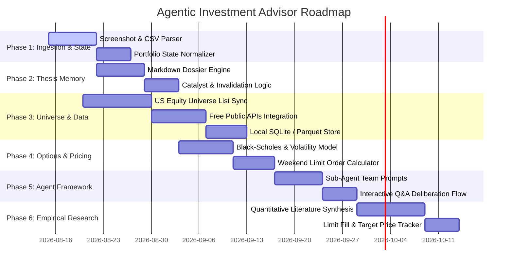

# Development Roadmap

This roadmap outlines the phased development plan for the **Agentic Investment Advisor & Context Provider** system. The objective is to build a reliable context engine, persistent thesis memory store, US equity universe pipeline, and options modeling framework for our AI agent team.

## High-Level Phases

## Phase 1: Portfolio Ingestion & State Normalization

**Goal:** Establish dependable parsing of weekly portfolio snapshots (multimodal images or CSV exports) into clean, structured textual context for the agent team.

- [x] **1.1 Private Ingestion & Privacy Architecture:** Configure `private/` (gitignored for real user snapshots/plans) and `examples/` (public synthetic onboarding templates).
- [ ] **1.2 Multimodal Screenshot Extractor:** Develop prompt/script workflows for parsing brokerage screenshots (symbols, share counts, cash balance, SGOV shares, open options contracts, expiration dates, and strikes).
- [ ] **1.3 CSV Portfolio Ingestor:** Build fallback parsing for tabular exports from standard US brokerages (Charles Schwab, Fidelity, Interactive Brokers, Robinhood).
- [ ] **1.4 Portfolio State Schema:** Normalize parsed data into a standard portfolio context object in `context/schemas/portfolio_context.json`:
  - Total liquid capital (Cash + `SGOV` market value).
  - Equity holdings with covered call eligibility flag (>= 100 shares).
  - Active options positions (CSPs, CCs, DTE, strike).

## Phase 2: Investment Thesis Memory Engine

**Goal:** Prevent agent amnesia and enable long-term thesis tracking across weekly runs using structured markdown dossiers in `context/theses/`.

- [x] **2.1 Dossier Schema Design:** Define standard markdown schema in `context/theses/EXAMPLE_THESIS.md` with:
  - Entry date, cost basis, target exit price.
  - Anticipated catalyst timeline (earnings, product launches, regulatory decisions, macro pivots).
  - Expected annualized ROI and investment horizon.
  - Explicit thesis invalidation criteria.
- [ ] **2.2 Memory Agent Integration:** Implement the `Thesis & Memory Agent` prompt to:
  - Ingest all active dossiers in `context/theses/`.
  - Compare incoming news/earnings against catalyst expectations.
  - Automatically flag broken theses with actionable sell/exit recommendations.
- [ ] **2.3 Dossier Update Automation:** Enable agents to draft and update dossiers after approved trade executions.

## Phase 3: US Equity Universe & Market Data Engine

**Goal:** Provide AI agents with complete visibility over all US exchange-listed public equities without relying on restrictive, token-expensive live queries.

- [ ] **3.1 Complete US Ticker Directory:** Generate and maintain a comprehensive list of all active stocks on NYSE, NASDAQ, and AMEX (~4,000–6,000 tickers).
- [ ] **3.2 Free Trustworthy API Connectors:** Build lightweight, deterministic Python scripts in `scripts/` leveraging public data sources:
  - `yfinance` / Yahoo Finance (historical daily/weekly OHLCV, market cap, PE, beta).
  - SEC EDGAR API (10-K, 10-Q filing dates, income statements, balance sheets).
  - Federal Reserve Economic Data (FRED) for interest rate & macro context.
- [ ] **3.3 Local SQLite / Parquet Cache:** Store weekly price summaries, moving averages (50-day, 200-day), 52-week ranges, and basic valuation multiples locally in `scripts/data/universe.db`.
- [ ] **3.4 Universe Screening Agent:** Equip the screening agent with predefined query filters to surface high-conviction candidates within the 25 position limit.

## Phase 4: Options Theoretical Pricing & Weekend Limit Calculator

**Goal:** Model option pricing over the weekend when markets are closed, generating precise Monday market-open limit orders for cash-secured puts, covered calls, and rolls.

- [ ] **4.1 Black-Scholes & Volatility Engine:** Implement a deterministic option pricing module in `scripts/option_pricer.py`:
  - Estimate Implied Volatility (IV) from historical volatility and sector averages.
  - Calculate theoretical option fair values, Greeks (Delta, Theta, Vega), and probability of profit (POP).
- [ ] **4.2 Cash-Secured Put (CSP) Strategy Module:**
  - Screen for high-conviction stocks trading near support.
  - Select optimal strikes (typically 0.15–0.30 delta, 30–45 DTE).
  - Compute Monday open limit prices that offer high risk-adjusted annualized return on collateral.
- [ ] **4.3 Covered Call (CC) Strategy Module:**
  - Identify holdings with 100 or more shares.
  - Select OTM strike prices above the cost basis aligned with the thesis price target.
  - Compute Monday limit order prices to collect premium or exit profitably.
- [ ] **4.4 Option Rolling Calculator:**
  - Detect threatened CSPs (ITM) or expiring CCs.
  - Compute net credit limit orders to roll out in time and down/up in strike.

## Phase 5: Sub-Agent Prompting Framework & Q&A Protocol

**Goal:** Standardize system prompts and coordination protocols for the specialized agent team in `context/prompts/`.

- [x] **5.1 Multi-Agent Architecture Guide:** Codify agent roles, inputs, and outputs in `http/docs/architecture.html`.
- [x] **5.2 Master Deliberation Prompt:** Create ready-to-use prompt templates in `context/prompts/weekly_deliberation.md` for weekly runs.
- [x] **5.3 Executive Report & Trading Plan Template:** Standardize the final weekly output format:
  - Executive Action Summary (Monday limit order table).
  - Position-by-position thesis review & catalyst check.
  - New trade proposals with target ROI, timeframe, and invalidation rules.
- [ ] **5.4 Interactive Q&A Protocol:** Provide structured prompt flows for challenging agent assumptions, probing risk factors, and stress-testing limit orders.

## Phase 6: Empirical Research Synthesis & Execution Calibration

**Goal:** Build institutional skill by synthesizing published quantitative options/equity research and maintaining a lightweight order fill tracker.

- [ ] **6.1 Quantitative Literature Synthesis:** Conduct deep research dives into institutional and academic options research (e.g., CBOE PutWrite/BuyWrite benchmarks, AQR factor studies, Tastytrade multi-decade options studies) to codify proven parameters (optimal DTE, delta, roll thresholds, VIX regime adjustments).
- [ ] **6.2 Monday Limit Fill & Target Tracker:** Create a lightweight markdown log (`private/plans/execution_tracker.md`) to record:
  - Modeled limit price vs. actual Monday open fill price.
  - Target price hit/miss rate across investment horizons.
  - Feed empirical fill rates back into the Derivatives Specialist agent to calibrate pricing aggression.
