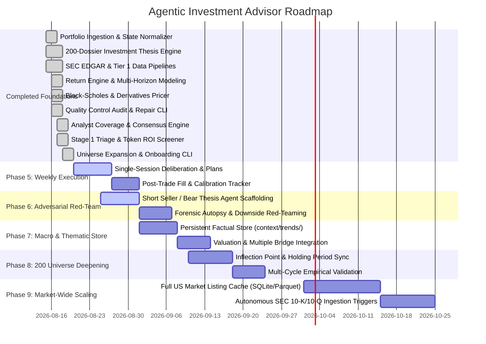

# Development Roadmap

This roadmap outlines the phased development plan for the **Agentic Investment Advisor & Context Provider** system. The objective is to build a high-performance quantitative context engine, persistent multi-horizon investment thesis store, adversarial deliberation pipeline, and single-session execution framework for our AI agent team to achieve >= 20% annualized returns over a 20-year horizon.

## High-Level Phases

## Phase 1: Portfolio Ingestion & State Normalization

**Goal:** Establish dependable parsing of weekly portfolio snapshots (multimodal images or CSV exports) into clean, structured textual context for the agent team while enforcing strict privacy firewalls.

- [x] **1.1 Private Ingestion & Privacy Architecture:** Configure `private/` (gitignored for real user snapshots/plans) and `examples/` (public synthetic onboarding templates). Codify strict one-way privacy firewall in Section 7 of [AGENTS.md](file:///c:/Users/Fred/github/investments/AGENTS.md).
- [x] **1.2 Multimodal Screenshot Extractor Workflow:** Codify multimodal extraction rules, OCR symbol mapping, lot extraction, and covered call eligibility rules in [.agents/skills/portfolio-ingestion/SKILL.md](file:///c:/Users/Fred/github/investments/.agents/skills/portfolio-ingestion/SKILL.md).
- [x] **1.3 CSV Portfolio Ingestor CLI:** Build deterministic parsing engine in [scripts/parse_snapshot.py](file:///c:/Users/Fred/github/investments/scripts/parse_snapshot.py) supporting tabular exports from standard US brokerages (Charles Schwab, Fidelity, Interactive Brokers, Robinhood) with automated account isolation and dry powder calculation.
- [x] **1.4 Portfolio State Schema:** Normalize parsed data into a standard portfolio context object in [context/schemas/portfolio_context.json](file:///c:/Users/Fred/github/investments/context/schemas/portfolio_context.json):
  - Total liquid capital (Cash + `SGOV` market value).
  - Equity holdings with covered call eligibility flag (>= 100 shares).
  - Active options positions (CSPs, CCs, DTE, strike, mark price).

## Phase 2: Investment Thesis & Portfolio Memory Engine

**Goal:** Prevent agent amnesia, enable long-term thesis tracking, and construct institutional 3-year quantitative forecasts using structured markdown dossiers in `context/theses/` and schemas in `context/schemas/`.

- [x] **2.1 Institutional Thesis Schema Design:** Define standard schema in [context/schemas/investment_thesis_schema.json](file:///c:/Users/Fred/github/investments/context/schemas/investment_thesis_schema.json) and populated across full dossiers in [context/theses/](file:///c:/Users/Fred/github/investments/context/theses/):
  - 13-Quarter Revenue Forecast Matrix ($Q_0$ to $Q_{12}$) with YoY growth and segment drivers.
  - 6-Horizon Shares Outstanding Projections (13, 26, 39, 52, 104, 156 weeks) with dilution/buyback modeling.
  - 4-Horizon Price Target Trading Ranges (13w, 52w, 104w, 156w) with Bear, Base, and Bull bounds.
  - Comprehensive Revenue Drivers Narrative and Valuation P/S Multiple Narrative.
  - Decisive Rating System (`BUY`, `HOLD`, `SELL`, `AVOID`).
  - Anticipated catalyst timeline, explicit invalidation criteria, and Tier 1 SEC EDGAR data provenance.
- [x] **2.2 Investment Thesis Agent Skill & Validator:**
  - Author comprehensive skill guide in [.agents/skills/investment-thesis/SKILL.md](file:///c:/Users/Fred/github/investments/.agents/skills/investment-thesis/SKILL.md).
  - Provide deterministic validation CLI script in [scripts/validate_thesis.py](file:///c:/Users/Fred/github/investments/scripts/validate_thesis.py).
- [x] **2.3 Portfolio Memory & Invalidation CLI:**
  - Implement deterministic memory manager in [scripts/manage_memory.py](file:///c:/Users/Fred/github/investments/scripts/manage_memory.py) to audit active dossiers, parse upcoming catalyst milestones, and evaluate broken theses.
  - Record operational agent guidelines in [.agents/skills/memory/SKILL.md](file:///c:/Users/Fred/github/investments/.agents/skills/memory/SKILL.md).
  - Maintain structured errata log in [context/research/errata_log.md](file:///c:/Users/Fred/github/investments/context/research/errata_log.md) conforming to [context/schemas/errata_schema.json](file:///c:/Users/Fred/github/investments/context/schemas/errata_schema.json).
- [x] **2.4 Deterministic Return Engine & Multi-Horizon Modeling:**
  - Build pure Python mathematical calculation engine in [scripts/return_engine.py](file:///c:/Users/Fred/github/investments/scripts/return_engine.py) computing unannualized Total ROI (%) and Compound Annual Growth Rate (CAGR / Annualized ROI %) across multi-year holding horizons and options strategy combinations (`SELL_CSP`, `LIMIT_BUY`, `SELL_COVERED_CALLS`, `LIMIT_SELL`).
  - Define formal JSON specification in [context/schemas/return_engine_schema.json](file:///c:/Users/Fred/github/investments/context/schemas/return_engine_schema.json).
- [x] **2.5 Bottom-Up Valuation Forecasting Engine:**
  - Build deterministic financial forecasting and valuation model in [scripts/valuation_model.py](file:///c:/Users/Fred/github/investments/scripts/valuation_model.py) generating 13-quarter revenue trajectories, 6-horizon shares outstanding, and 4-horizon price targets.

## Phase 3: US Equity Universe, Data Sources & Provenance Engine

**Goal:** Establish authoritative data source hierarchy, access methodologies, AI agent parametric knowledge attribution, and US equity universe visibility.

- [x] **3.1 Authoritative Data Sources & Provenance Architecture:**
  - Codify 5-tier source hierarchy in [context/sources/catalog.md](file:///c:/Users/Fred/github/investments/context/sources/catalog.md) (Tier 1 SEC EDGAR / Exchanges down to Tier 4 Agent Parametric Memory).
  - Define granular data provenance schema ([context/schemas/data_provenance.json](file:///c:/Users/Fred/github/investments/context/schemas/data_provenance.json)) and agent runtime context signature.
  - Implement data verification and errata tracking protocol ([context/schemas/errata_schema.json](file:///c:/Users/Fred/github/investments/context/schemas/errata_schema.json), [context/research/errata_log.md](file:///c:/Users/Fred/github/investments/context/research/errata_log.md)).
  - Publish interactive web guide at [http/docs/sources.html](file:///c:/Users/Fred/github/investments/http/docs/sources.html).
- [x] **3.2 ETF Holdings Discovery & Universe Expansion (QQQ & DJIA Benchmarks):**
  - Record agent skill in [.agents/skills/etf-holdings/SKILL.md](file:///c:/Users/Fred/github/investments/.agents/skills/etf-holdings/SKILL.md) and CLI extractor in [scripts/fetch_etf_holdings.py](file:///c:/Users/Fred/github/investments/scripts/fetch_etf_holdings.py) to parse Tier 1 Form NPORT-P filings (Invesco QQQ CIK `0001067839`, SPDR DIA CIK `0001041130`, SPDR SPY CIK `0000884394`).
  - Expand universe catalog ([context/data/universe.json](file:///c:/Users/Fred/github/investments/context/data/universe.json), [http/data/universe.json](file:///c:/Users/Fred/github/investments/http/data/universe.json)) across QQQ, DJIA, and high-growth innovators.
  - Verify live explorer rendering, sector filtering, and locked 2x2 grid metrics in [http/stocks.html](file:///c:/Users/Fred/github/investments/http/stocks.html).
- [x] **3.3 SEC EDGAR XBRL Pipeline & CLI Utilities:**
  - [scripts/fetch_sec.py](file:///c:/Users/Fred/github/investments/scripts/fetch_sec.py) automated XBRL company facts extractor for US GAAP and IFRS filers.
  - [scripts/build_sec_data.js](file:///c:/Users/Fred/github/investments/scripts/build_sec_data.js) automated TTM revenue and shares aggregator.
  - [scripts/build_universe_json.py](file:///c:/Users/Fred/github/investments/scripts/build_universe_json.py) master catalog synthesis engine.
- [x] **3.4 Sell-Side Analyst Registry & Precision Search Permalinks:**
  - Seed and reprocess analyst records across equities in [scripts/data/analyst_price_targets.json](file:///c:/Users/Fred/github/investments/scripts/data/analyst_price_targets.json) with historical prices at announcement dates and precision Google Search permalinks.
  - Standardize schema in [context/schemas/analyst_coverage_registry_schema.json](file:///c:/Users/Fred/github/investments/context/schemas/analyst_coverage_registry_schema.json) and compile consolidated registry in [scripts/build_analyst_registry.py](file:///c:/Users/Fred/github/investments/scripts/build_analyst_registry.py).
- [x] **3.5 Stage 1 Triage Screener & Token ROI Optimizer:**
  - Build deterministic triage engine in [scripts/triage_universe.py](file:///c:/Users/Fred/github/investments/scripts/triage_universe.py) separating uninvestable value traps (`AVOID`) from high-conviction opportunities (`QUALIFIED_CANDIDATE`).
  - Document optimization protocol in [context/strategy/token_triage_and_avoid_pipeline.md](file:///c:/Users/Fred/github/investments/context/strategy/token_triage_and_avoid_pipeline.md) and [context/strategy/avoid_vs_sell_framework.md](file:///c:/Users/Fred/github/investments/context/strategy/avoid_vs_sell_framework.md).
- [x] **3.6 Off-Balance Sheet Liabilities Data Pipeline:**
  - Implement comprehensive off-balance sheet financial extractor in [scripts/build_off_balance_sheet_data.py](file:///c:/Users/Fred/github/investments/scripts/build_off_balance_sheet_data.py) compiling operating leases, purchase obligations, pension shortfalls, and credit facility terms conforming to [context/strategy/off_balance_sheet_liabilities_framework.md](file:///c:/Users/Fred/github/investments/context/strategy/off_balance_sheet_liabilities_framework.md).
- [x] **3.7 Deterministic Quality Control & Data Integrity Engine:**
  - Build comprehensive audit and auto-repair CLI tool in [scripts/quality_control.py](file:///c:/Users/Fred/github/investments/scripts/quality_control.py) verifying SEC CIK concordance, stock prices, technical bounds, index memberships, financial accounting math, thesis schema compliance, and cross-store data parity with 0 errors / 0 warnings.
- [x] **3.8 On-Demand Coverage Universe Expansion & Screening Pipeline:**
  - Implement deterministic onboarding engine in [scripts/onboard_company.py](file:///c:/Users/Fred/github/investments/scripts/onboard_company.py) supporting single, multi-symbol batch, and screened candidate additions on demand.
  - Connect Equity Research Agent to automated 20%+ ROI screening, Stage 1 Triage gating, SEC EDGAR XBRL ingestion, valuation modeling, thesis generation, and quality control auditing.
  - Deploy comprehensive protocol in [context/prompts/onboard_company.md](file:///c:/Users/Fred/github/investments/context/prompts/onboard_company.md), [http/docs/workflow.html](file:///c:/Users/Fred/github/investments/http/docs/workflow.html), and [http/guide.html](file:///c:/Users/Fred/github/investments/http/guide.html) (Cadence 5).

- [ ] **3.9 Fundamental Financial Metrics Extraction (Unblocks Stage 1 Triage):**
  - Extend [scripts/fetch_sec.py](file:///c:/Users/Fred/github/investments/scripts/fetch_sec.py) to extract income statement and cash flow concepts from the SEC XBRL `companyfacts` endpoint that the Stage 1 triage gate already reads but which no pipeline currently populates: `gross_margin_pct`, `operating_margin_pct`, `net_income`, `operating_cash_flow`, `capital_expenditure`, `free_cash_flow_usd_m`, `shareholders_equity`, `debt_to_equity`, `annual_dilution_pct`, `cash_runway_months`, and `roic`.
  - Audited 2026-08-28: all of these are present in 0 of 175 universe records, so every threshold in [scripts/triage_universe.py](file:///c:/Users/Fred/github/investments/scripts/triage_universe.py) is guarded by a `is not None` check that silently passes. The gate documented in Section 5 of [AGENTS.md](file:///c:/Users/Fred/github/investments/AGENTS.md) currently filters nothing.
  - Note that `debt_to_equity` is uncomputable today despite `total_debt` being stored, because shareholders' equity is absent from every record.
  - Propagate the new fields through [scripts/build_universe_json.py](file:///c:/Users/Fred/github/investments/scripts/build_universe_json.py) and re-enable genuine triage gating. Tracked as [OQI-2026-08-006](file:///c:/Users/Fred/github/investments/context/research/open_questions_and_issues.md).
- [ ] **3.10 Universe Record Schema Arbitration & Price Series Integrity Assertions:**
  - Establish a single authoritative universe record schema in `context/schemas/`, and require both [scripts/build_universe_json.py](file:///c:/Users/Fred/github/investments/scripts/build_universe_json.py) and [scripts/quality_control.py](file:///c:/Users/Fred/github/investments/scripts/quality_control.py) to validate against it before writing. The two currently maintain divergent record definitions (approximately 95 fields versus approximately 49), and the `--fix` repair path silently destroys 46 fields per record across the entire universe, including all 13-quarter revenue forecasts, 4-horizon price targets, 6-horizon share projections, and every return-engine output. Recorded as ERR-2026-08-014.
  - Add a concordance assertion to [scripts/quality_control.py](file:///c:/Users/Fred/github/investments/scripts/quality_control.py) requiring `previous_close == nominal_previous_close` whenever `cumulative_split_factor == 1.0`. Audited 2026-08-28: 170 of 175 records violate this, producing implausible single-session moves (ABNB +39.59%, ADP +30.80%). Broker-observed ENVX day change was $0.00 against a stored -52.13%. Recorded as ERR-2026-08-015.
  - Require any `|day_change_percent|` above a configured threshold to be corroborated by a volume anomaly or an explicit recorded override before it is written.

## Phase 4: Options Theoretical Pricing & Weekend Limit Calculator

**Goal:** Model option pricing over the weekend when markets are closed, generating precise Monday market-open limit orders for cash-secured puts, covered calls, and rolls.

- [x] **4.1 Black-Scholes & Volatility Engine:** Implement deterministic option pricing module in [scripts/calculate_pricing.py](file:///c:/Users/Fred/github/investments/scripts/calculate_pricing.py):
  - Estimate Implied Volatility (IV) from historical volatility and sector averages.
  - Calculate theoretical option fair values, Greeks (Delta, Theta, Gamma, Vega), and Annualized Return on Collateral (AROC).
- [x] **4.2 Cash-Secured Put (CSP) Strategy Module:**
  - Screen for high-conviction stocks trading near support levels.
  - Select optimal strikes (typically 0.15–0.30 delta, 30–45 DTE).
  - Compute Monday open limit prices that offer high risk-adjusted annualized return on collateral (AROC >= 12% - 18%).
- [x] **4.3 Covered Call (CC) Strategy Module:**
  - Identify holdings with 100 or more shares.
  - Select OTM strike prices aligned with the 52-week thesis price target and technical resistance levels.
  - Compute Monday limit order prices to harvest incremental yield or structure disciplined profitable exits.
- [x] **4.4 Option Rolling & Buy-to-Close (BTC) Calculator:**
  - Validate net-credit roll economics via [scripts/calculate_pricing.py](file:///c:/Users/Fred/github/investments/scripts/calculate_pricing.py) (`roll` subcommand).
  - Enforce strict risk rule prohibiting net-debit rolls.
  - Calculate Buy-to-Close (BTC) limit prices and risk mitigation metrics on losing propositions / broken theses via [scripts/calculate_pricing.py](file:///c:/Users/Fred/github/investments/scripts/calculate_pricing.py) (`btc` subcommand).
  - Avert assignment into declining stocks (short puts) and liberate 100-share blocks for immediate market open liquidation (short calls).

## Phase 5: Single-Session Weekly Execution & Deliberation Engine

**Goal:** Standardize multi-agent deliberation workflows, isolated sequential portfolio execution, and human-centric plain ASCII trading plans in `private/plans/`.

- [x] **5.1 Multi-Agent Architecture Guide:** Codify agent roles, boundaries, inputs, and outputs in [http/docs/architecture.html](file:///c:/Users/Fred/github/investments/http/docs/architecture.html).
- [x] **5.2 Master Deliberation Prompt:** Create ready-to-use prompt templates in [context/prompts/weekly_deliberation.md](file:///c:/Users/Fred/github/investments/context/prompts/weekly_deliberation.md) for weekly runs.
- [x] **5.3 Executive Report & Trading Plan Generator:**
  - Human-centric plain ASCII text layout ([private/plans/YYYY-MM-DD-plan.txt](file:///c:/Users/Fred/github/investments/private/plans/)).
  - Isolated sequential portfolio execution sections with account snapshots.
  - Numbered single-session Monday 9:30 AM ET limit orders with deterministic execution-time branching contingencies.
  - Friday automated option expiration and settlement expectations.
  - Deterministic plan generator tool in [scripts/generate_plan.py](file:///c:/Users/Fred/github/investments/scripts/generate_plan.py) conforming to [context/schemas/trading_plan_schema.json](file:///c:/Users/Fred/github/investments/context/schemas/trading_plan_schema.json).
- [ ] **5.4 Live Snapshots Ingestion & Execution Trial:** Execute live weekly run using real user portfolio snapshots placed in `private/snapshots/`, generating validated Monday morning trading plans.
- [ ] **5.5 Monday Limit Fill & Target Tracker:** Implement lightweight execution tracker in `private/plans/execution_tracker.md` to record:
  - Modeled limit price vs. actual Monday open fill price.
  - Limit order fill rate and slippage statistics.
  - Target price hit/miss rate across investment horizons to calibrate limit order aggression.

## Phase 6: Adversarial Red-Teaming, Short Seller & Sentiment Surveillance

**Goal:** Eliminate confirmation bias, monitor market-moving activist short campaigns, surveil retail/press sentiment friction, and establish tiered operational cadences for maximum token parsimony (addressing [OQI-2026-08-002](file:///c:/Users/Fred/github/investments/context/research/open_questions_and_issues.md)).

- [x] **6.1 Influential Short Sellers Directory & Surveillance CLI:**
  - Curate comprehensive directory of 20 influential short sellers in [context/sources/short_sellers_directory.json](file:///c:/Users/Fred/github/investments/context/sources/short_sellers_directory.json) conforming to [context/schemas/short_sellers_directory_schema.json](file:///c:/Users/Fred/github/investments/context/schemas/short_sellers_directory_schema.json).
  - Build active short campaign tracking engine in [scripts/track_short_sellers.py](file:///c:/Users/Fred/github/investments/scripts/track_short_sellers.py) generating [context/data/short_seller_campaigns.json](file:///c:/Users/Fred/github/investments/context/data/short_seller_campaigns.json).
- [x] **6.2 Press & Investor Sentiment Surveillance Engine:**
  - Build corporate newswire and social chatter surveillance engine in [scripts/surveil_sentiment.py](file:///c:/Users/Fred/github/investments/scripts/surveil_sentiment.py) conforming to [context/schemas/investor_sentiment_schema.json](file:///c:/Users/Fred/github/investments/context/schemas/investor_sentiment_schema.json) and [context/sources/investor_sentiment_sources.json](file:///c:/Users/Fred/github/investments/context/sources/investor_sentiment_sources.json).
  - Extract sentiment scores (-100 to +100), discussion velocity, and key investor friction themes across Reddit (r/stocks, r/wallstreetbets, r/ValueInvesting) and PR wires.
- [x] **6.3 SEC Filing Statutory Schedule & Anticipation Engine:**
  - Implement statutory deadline and filing window projection engine in [scripts/anticipate_sec_filings.py](file:///c:/Users/Fred/github/investments/scripts/anticipate_sec_filings.py) conforming to [context/schemas/sec_filing_calendar_schema.json](file:///c:/Users/Fred/github/investments/context/schemas/sec_filing_calendar_schema.json).
  - Generate automated 14-day and 30-day imminent filing calendar in [context/data/sec_filing_calendar.json](file:///c:/Users/Fred/github/investments/context/data/sec_filing_calendar.json).
- [x] **6.4 Token Parsimony Architecture & Modular Prompt Suite:**
  - Codify token budget hierarchy in [context/strategy/token_parsimony_and_operational_cadences.md](file:///c:/Users/Fred/github/investments/context/strategy/token_parsimony_and_operational_cadences.md).
  - Deploy modular prompt protocols for all 6 operational cadences:
    - [context/prompts/frequent_price_volume_refresh.md](file:///c:/Users/Fred/github/investments/context/prompts/frequent_price_volume_refresh.md) (Cadence 1: Daily Price & Volume Refresh, 0 Tokens)
    - [context/prompts/scheduled_sec_ingestion.md](file:///c:/Users/Fred/github/investments/context/prompts/scheduled_sec_ingestion.md) (Cadence 2: Scheduled SEC Ingestion, ~500 Tokens/Stock)
    - [context/prompts/sentiment_and_short_seller_surveillance.md](file:///c:/Users/Fred/github/investments/context/prompts/sentiment_and_short_seller_surveillance.md) (Cadence 3: Press & Short Report Alerts, ~1K Tokens)
    - [context/prompts/weekly_deliberation.md](file:///c:/Users/Fred/github/investments/context/prompts/weekly_deliberation.md) (Cadence 4: Weekly Single-Session Plan, ~2K-5K Tokens)
    - [context/prompts/onboard_company.md](file:///c:/Users/Fred/github/investments/context/prompts/onboard_company.md) (Cadence 5: Universe Expansion & Coverage Onboarding, ~10K-15K Tokens)
    - [context/prompts/rare_full_source_regeneration.md](file:///c:/Users/Fred/github/investments/context/prompts/rare_full_source_regeneration.md) (Cadence 6: Full Ground-Truth Rebuild)
- [x] **6.5 User Guide & Operational Cadences Web Interface:**
  - Overhaul [http/guide.html](file:///c:/Users/Fred/github/investments/http/guide.html) into an interactive operational guide showcasing the 6 cadences, token economy table, copy-paste CLI commands, and short seller directory.

## Phase 7: Persistent Macro & Thematic Knowledge Store (`context/trends/`)

**Goal:** Establish a dedicated factual knowledge store in `context/trends/` capturing secular disruptions, macro yield regimes, and technological waves, providing an objective factual foundation that AI agents synthesize at deliberation time (addressing [OQI-2026-08-003](file:///c:/Users/Fred/github/investments/context/research/open_questions_and_issues.md)).

- [ ] **7.1 Thematic Knowledge Store Architecture & Schema:**
  - Create `context/trends/` directory structure with JSON schema in `context/schemas/trend_dossier_schema.json`.
  - Establish standardized dossier format: Secular Theme Overview, Key Macro Facts & Data Points, Industry Impact & TAM Trajectory, Direct Beneficiaries (Long Candidates), Direct Casualties / Disruptive Threats (Avoid/Short Candidates), and Key Macro Invalidation Indicators.
- [ ] **7.2 Initial Core Factual Trend Dossiers:**
  - `context/trends/AI_COMPUTE_INFRASTRUCTURE.md`: Capex trajectories of hyperscalers, GPU cluster power density, custom ASIC silicon adoption, networking bottlenecks.
  - `context/trends/ENERGY_GRID_POWER_CONSTRAINTS.md`: Nuclear SMR commercialization, grid interconnection queues, baseload power supply, natural gas turbine demand.
  - `context/trends/ENTERPRISE_SAAS_MULTIPLE_RERATING.md`: Seat-based pricing disruption, AI agent displacement, gross margin compression, multiple contraction dynamics.
  - `context/trends/INTEREST_RATE_REGIMES_COST_OF_CAPITAL.md`: Global sovereign debt yields, high-for-longer hurdle rates, debt refinancing maturity walls.
  - `context/trends/ADVANCED_PACKAGING_SEMICONDUCTOR_EQUIPMENT.md`: High-Bandwidth Memory (HBM), CoWoS packaging capacity, EUV lithography cycles.
- [ ] **7.3 Top-Down to Bottom-Up Valuation Bridge:**
  - Connect thematic and macro facts directly to parameter inputs in [scripts/valuation_model.py](file:///c:/Users/Fred/github/investments/scripts/valuation_model.py) (e.g. dynamic terminal multiple ceilings, cost of capital hurdle rates, and revenue acceleration/deceleration coefficients).
  - Update deliberation prompts to require explicit citation of factual trend dossiers when adjusting growth or valuation multiples.

## Phase 8: Deepening Universe & Holding Period Calibration

**Goal:** Deepen qualitative moats, catalyst timelines, and product-level inflection points for all universe constituents, quantitatively synchronizing target holding periods with predicted business inflection points (addressing [OQI-2026-08-001](file:///c:/Users/Fred/github/investments/context/research/open_questions_and_issues.md) and [OQI-2026-08-004](file:///c:/Users/Fred/github/investments/context/research/open_questions_and_issues.md)).

- [ ] **8.1 Deep Dossier Enrichment Across Universe Equities:**
  - Upgrade qualitative moats, revenue segment breakdowns, and product-level catalyst bridges for all equities in [context/theses/](file:///c:/Users/Fred/github/investments/context/theses/).
  - Audit catalyst calendars against actual upcoming SEC earnings release dates and product announcements.
- [ ] **8.2 Holding Period & Inflection Point Calibration Engine:**
  - Classify each thesis into distinct investment archetypes:
    - *Catalyst / Inflection Plays (1 to 2 Years / 4 to 8 Quarters)*: Operational turnaround, margin inflection, new product ramp.
    - *High-ROIC Secular Compounders (3 to 5+ Years / Indefinite)*: Durable moats, ROIC > 15%, large reinvestment runway.
    - *Cyclical / Capex Swings (2 to 3 Years / 8 to 12 Quarters)*: Trough-cycle entry to peak-cycle exit.
  - Quantitatively calibrate expected holding period duration in [scripts/return_engine.py](file:///c:/Users/Fred/github/investments/scripts/return_engine.py) to maximize annualized IRR and covered call yield harvesting.
- [ ] **8.3 Empirical Multi-Cycle Validation & Backtesting:**
  - Benchmark thesis forecasting accuracy against historical 5-year and 10-year multi-cycle market distributions.
  - Maintain benchmark data in [context/research/roi_distribution_benchmarks.md](file:///c:/Users/Fred/github/investments/context/research/roi_distribution_benchmarks.md).

## Phase 9: Market-Wide Universe Scaling (~4,000–6,000 Equities)

**Goal:** Expand scanning and screening capabilities across the full US equity market (NYSE, NASDAQ, AMEX common stocks) into a high-performance local SQLite / Parquet cache once the core foundation is fully optimized.

- [ ] **9.1 Master US Market Directory Sync:**
  - Build automated ingestion engine pulling all active US exchange-listed common stocks (~4,000–6,000 tickers) into a local SQLite store (`scripts/data/universe.db`).
  - Cache market caps, 52-week high/low ranges, trading volumes, and primary exchange codes.
- [ ] **9.2 Automated SEC 10-K/10-Q Filing Ingestion Triggers:**
  - Build continuous SEC EDGAR RSS / EFTS ingestion daemon to detect newly filed 10-K and 10-Q reports.
  - Automatically extract XBRL company facts and update fundamental metric stores in real time.
- [ ] **9.3 Market-Wide Quantitative Alpha Screener:**
  - Scale [scripts/screen_market.py](file:///c:/Users/Fred/github/investments/scripts/screen_market.py) and [scripts/triage_universe.py](file:///c:/Users/Fred/github/investments/scripts/triage_universe.py) across the full SQLite universe to surface undiscovered compounders and spin-offs meeting the 20%+ annualized hurdle rate.
