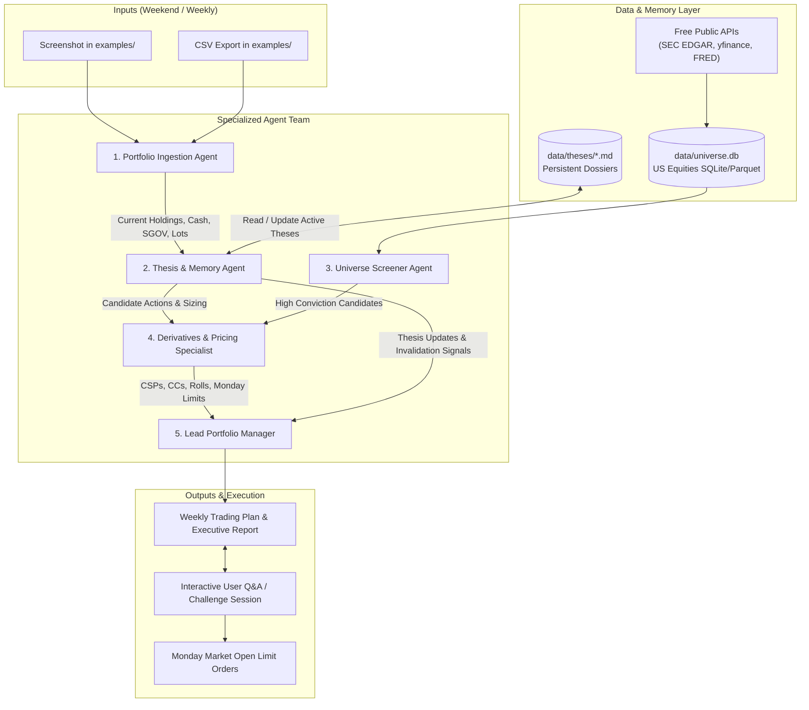

# System Architecture: Agentic Investment Advisor

This document details the multi-agent system architecture, agent team specialization, data pipelines, and decision-making workflows that power the **Agentic Investment Advisor & Context Provider**.

## Architecture Overview

Standard LLM chatbots fail at personalized portfolio management because they suffer from:
1. **Chatbot Friction & Guardrail Evasion:** Refusing to give specific advice or defaulting to generic broad index funds.
2. **Narrow Market Scope:** Inability to evaluate thousands of public companies simultaneously.
3. **Session Amnesia:** Losing the original investment thesis, catalyst dates, and price targets established in prior weeks.
4. **Lack of Derivatives Modeling:** Inability to price options over the weekend and set realistic limit orders.

To resolve these limitations, this system decouples portfolio advisory into a pipeline of specialized sub-agent roles backed by a deterministic local data and memory layer.

## Sub-Agent Roles & Responsibilities

### 1. Portfolio Ingestion Agent
- **Purpose:** Parse raw portfolio artifacts into structured portfolio context.
- **Input:** Weekend screenshot (image) or brokerage CSV export placed in `examples/`.
- **Key Tasks:**
  - Extract equity positions with exact share counts.
  - Identify options contracts (puts/calls, strike, expiration date, count).
  - Extract cash balance and `SGOV` shares/value.
  - Calculate covered call eligibility: flag every holding where `shares >= 100` (and how many 100-share blocks exist).
- **Output:** Clean structured text / JSON representation of current portfolio state.

### 2. Thesis & Memory Agent
- **Purpose:** Maintain long-term investment conviction, track catalysts, and detect broken theses.
- **Input:** Parsed portfolio holdings + markdown dossiers from `data/theses/*.md`.
- **Key Tasks:**
  - Retrieve existing thesis, catalyst calendar, expected annualized ROI, and invalidation rules for each holding.
  - Cross-check recent developments (earnings reports, guidance, regulatory actions, macro changes) against catalyst expectations.
  - Flag thesis invalidations (e.g., missed earnings, canceled product line, management departure) and recommend immediate or structured exit.
  - Ensure all active holdings have a live dossier and target exit price.
- **Output:** Portfolio Health & Thesis Evaluation Report.

### 3. Universe Screener & Fundamental Analyst
- **Purpose:** Screen the complete universe of US public exchange-traded equities to surface high-conviction opportunities.
- **Input:** `data/universe.db` (local SQLite/Parquet cache) + screening criteria.
- **Key Tasks:**
  - Filter across NYSE, NASDAQ, AMEX equities (excluding mutual funds and non-SGOV ETFs).
  - Apply fundamental quality screens (profitability, free cash flow yield, debt health, competitive moat).
  - Enforce the **$\le 25$ position concentration limit** (recommends new tickers only if cash/SGOV is unallocated or an existing position is liquidated).
- **Output:** Curated shortlist of candidate equities with fundamental rationales and target price/timeframe expectations.

### 4. Derivatives & Limit Pricing Specialist
- **Purpose:** Design safe options strategies and calculate theoretical prices to set Monday market-open limit orders.
- **Input:** Candidate tickers, current stock holdings, cash collateral, and market volatility data.
- **Key Tasks:**
  - **Cash-Secured Puts (CSPs):** Select optimal strikes ($\sim 0.15\text{--}0.30$ delta, $30\text{--}45$ DTE) on target buy-candidates backed 100% by cash or SGOV collateral.
  - **Covered Calls (CCs):** Select OTM strike prices above cost basis on $\ge 100$ share lots to harvest income or scale out at target.
  - **Option Rolls:** Identify ITM or expiring options; structure rolls out in time and down/up in strike for net credits.
  - **Theoretical Pricing:** Model Black-Scholes and implied volatility over the weekend to compute realistic limit order prices for Monday 9:30 AM ET execution.
- **Output:** Monday Limit Order Sheet (Strikes, Expirations, Limit Prices, Capital Required/Freed).

### 5. Lead Portfolio Manager
- **Purpose:** Synthesize sub-agent outputs, enforce all safety constraints, generate the final weekly executive report, and engage with the user.
- **Input:** Reports from all four sub-agents.
- **Key Tasks:**
  - Compile the **Weekly Trading Plan & Executive Report**.
  - Validate 100% compliance with portfolio constraints (US equities, SGOV cash proxy, CSP/CC only, $\le 25$ holdings, weekly cadence).
  - Facilitate the **Interactive User Q&A / Challenge Session**, answering user inquiries and stress-testing assumptions.
- **Output:** Final actionable weekly executive report and execution-ready limit order table.

## Data Privacy & Ingestion Design

1. **Local-First & Git-Ignored:**
   - Brokerage screenshots, account balances, and raw CSVs are saved in `examples/`, which is permanently listed in `.gitignore`.
   - No private financial credentials or account identifiers are ever checked into source control.
2. **Deterministic Context Construction:**
   - Agent prompts are supplied with structured files and database queries, drastically minimizing token overhead while ensuring complete context.
