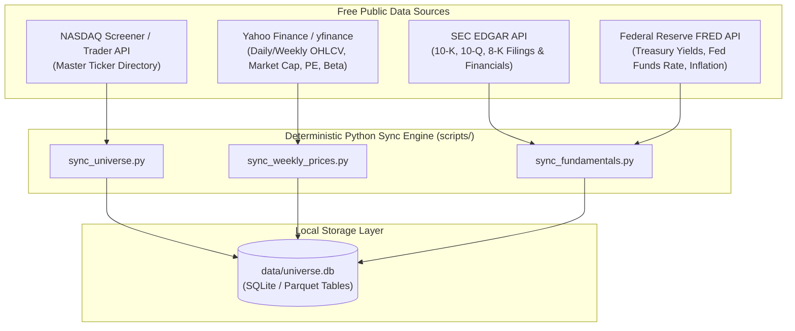

# US Equity Universe & Data Strategy

This document details how the repository manages the complete universe of US exchange-listed public equities, ingests financial data from trustworthy free public APIs, and maintains a local SQLite/Parquet cache for agent screening and analysis.

---

## 🎯 The Context Challenge

Standard LLMs suffer from "universe blindness"—when asked to screen for investment opportunities, they can only recall a few dozen popular mega-cap companies (Apple, Microsoft, Tesla, Nvidia) from their pre-training weights.

To give our agent team institutional-grade screening capability across the **entire US public market (~4,000–6,000 active tickers)** without incurring prohibitive token costs or slow online scraping, this system builds a **local-first universe cache**.

---

## 🏛️ 1. Complete US Public Equity Universe

### Scope & Inclusion Criteria
- **Exchanges:** New York Stock Exchange (NYSE), NASDAQ, and NYSE American (AMEX).
- **Security Types:**
  - Common stocks.
  - American Depositary Receipts (ADRs) of international companies listed on US exchanges.
  - `SGOV` (iShares 0-3 Month Treasury Bond ETF) as the sole permitted cash proxy.
- **Exclusions:**
  - Closed-end funds, unit investment trusts, and non-SGOV ETFs.
  - Over-the-counter (OTC / Pink Sheets) penny stocks.
  - Warrants, rights, and structured notes.

---

## 🌐 2. Trustworthy Free Public Data APIs

The system utilizes free, authoritative public endpoints to maintain historical prices and fundamental data:



### Data Source Specifications

| Source | Endpoints / Method | Data Provided | Sync Frequency |
| :--- | :--- | :--- | :--- |
| **NASDAQ Screener** | `nasdaq.com/api/v1/screener` | Full master ticker list, company name, sector, exchange, market cap | Monthly |
| **Yahoo Finance (`yfinance`)** | `yfinance.download()` / `Ticker()` | Weekly OHLCV bars, 52-week high/low, beta, PE ratio, dividend yield | Weekly (Friday close) |
| **SEC EDGAR API** | `data.sec.gov/api/xbrl/companyfacts/` | Official 10-K and 10-Q balance sheets, revenue, operating cash flow | Quarterly / As filed |
| **FRED API** | `fred.stlouisfed.org/api/` | 3-Month US Treasury Rate (risk-free rate $r$ for Black-Scholes), CPI, Fed rate | Weekly |

---

## 💾 3. Local SQLite & Parquet Schema

Data is stored in `data/universe.db` to allow fast, deterministic agent querying with zero token overhead:

### Schema Overview

#### Table 1: `equities` (Master Ticker Directory)
```sql
CREATE TABLE equities (
    ticker TEXT PRIMARY KEY,
    name TEXT NOT NULL,
    exchange TEXT NOT NULL,          -- NYSE, NASDAQ, AMEX
    sector TEXT,
    industry TEXT,
    market_cap REAL,
    is_active INTEGER DEFAULT 1,
    last_updated DATE
);
```

#### Table 2: `weekly_price_bars` (Price Trend & Volatility)
```sql
CREATE TABLE weekly_price_bars (
    ticker TEXT,
    week_end_date DATE,
    open REAL,
    high REAL,
    low REAL,
    close REAL,
    volume INTEGER,
    sma_50 REAL,                     -- 50-day moving average
    sma_200 REAL,                    -- 200-day moving average
    realized_vol_30d REAL,           -- 30-day realized volatility for BSM
    realized_vol_90d REAL,           -- 90-day realized volatility for BSM
    PRIMARY KEY (ticker, week_end_date),
    FOREIGN KEY (ticker) REFERENCES equities(ticker)
);
```

#### Table 3: `fundamentals` (Quality & Valuation Metrics)
```sql
CREATE TABLE fundamentals (
    ticker TEXT PRIMARY KEY,
    pe_ratio REAL,
    forward_pe REAL,
    fcf_yield REAL,                  -- Free Cash Flow Yield
    debt_to_equity REAL,
    operating_margin REAL,
    dividend_yield REAL,
    next_earnings_date DATE,
    last_filing_date DATE,
    FOREIGN KEY (ticker) REFERENCES equities(ticker)
);
```

---

## 🔍 4. Deterministic Helper Scripts (`scripts/`)

To keep data management simple and repeatable, the repository provides Python scripts in `scripts/`:

1. `scripts/sync_universe.py`: Pulls active ticker listings from exchange feeds and populates `data/universe.db`.
2. `scripts/update_weekly_prices.py`: Fetches weekly price bars for universe tickers and computes moving averages and realized volatility.
3. `scripts/screen_candidates.py`: Executes standard screening filters (e.g., FCF yield $> 6\%$, positive operating margin, low debt, trading near 200-day SMA support) and outputs a markdown table for the Universe Screener Agent.
