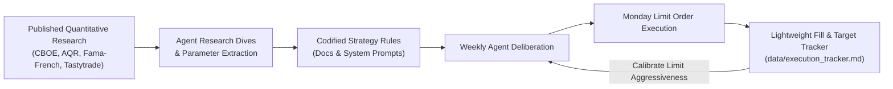

# Empirical Research Synthesis & Execution Calibration

This document outlines how the system acquires institutional-grade investment skill without burning excessive tokens on heavy simulation backtests. It details:
1. **Synthesizing Published Quantitative Research:** Leveraging decades of institutional options studies and empirical finance literature.
2. **Lightweight Execution Calibration Tracker:** A zero-token internal tracker for Monday limit order fills and price target hit-rates.

## 1. Synthesizing Published Quantitative Research

Rather than attempting to simulate decades of daily market data internally, the agent team conducts deep research dives into battle-tested empirical studies from academia and quantitative trading institutions.



### Key Empirical Findings Codified in System Rules

#### A. The Volatility Risk Premium (VRP) & Option Selling (CBOE & Academic Literature)
- **Finding:** Implied volatility systematically exceeds realized volatility over long horizons ($> 85\%$ of monthly cycles).
- **Application:** Selling Cash-Secured Puts (CSPs) and Covered Calls (CCs) systematically captures the VRP, generating higher risk-adjusted returns than pure buy-and-hold equity strategies.
- **Reference Indices:** Cboe S&P 500 PutWrite Index (`PUT`), Cboe S&P 500 BuyWrite Index (`BXM`).

#### B. Optimal DTE & Delta for Premium Harvesting (Tastytrade 15-Year Studies)
- **Finding:** Selling options at $30\text{--}45$ DTE with deltas between $0.15\text{ and }0.30$ maximizes theta decay efficiency while limiting tail-risk delta exposure. Managing or rolling options when DTE drops below 14–21 days significantly reduces gamma risk.
- **Application:** The Derivatives Specialist agent constrains CSP and CC proposals to the 30–45 DTE window with 0.15–0.30 delta.

#### C. Fundamental Quality & Value Premia (AQR / Fama-French Factor Research)
- **Finding:** Equities exhibiting strong Free Cash Flow yield, low financial leverage, and robust operating margins dramatically outperform speculative growth during market downturns.
- **Application:** The Universe Screener agent strictly screens for balance sheet durability, pricing power, and positive FCF.

## 2. Lightweight Execution Calibration Tracker

To monitor system accuracy and continuously refine Monday morning limit pricing without token overhead, the repository maintains `data/execution_tracker.md`.

### Tracker Schema (`data/execution_tracker.md`)

```markdown
# Execution & Target Calibration Tracker

## 1. Monday Limit Order Execution Log

| Date | Ticker | Order Type | Modeled Fair Value | Modeled Limit Price | Actual Open Price | Filled? (Y/N) | Fill Price | Execution Slippage / Edge |
| :--- | :--- | :--- | :--- | :--- | :--- | :--- | :--- | :--- |
| 2026-08-18 | INTC | Sell 2x Sep25 $20 Put | $0.85 | $0.80 | $0.82 | **Y** | $0.81 | +$0.01 price improvement |
| 2026-08-18 | BA   | Sell 2x Sep25 $210 Call | $3.40 | $3.30 | $3.15 | **N** | — | Missed (Stock opened down) |

## 2. Price Target & Catalyst Hit-Rate Log

| Ticker | Entry Date | Initial Price Target | Expected Horizon | Catalyst Event | Actual Date Achieved | Hit / Miss / In Progress | Annualized ROI Realized |
| :--- | :--- | :--- | :--- | :--- | :--- | :--- | :--- |
| BA | 2026-03-15 | $265.00 | 3-5 Years | FAA Rate Cap Review | — | In Progress | Tracking +14.2% |
```

## Calibration Feedback Loop

Each weekend during **Step 4 (Derivatives & Limit Pricing)**, the Derivatives Specialist agent reviews recent rows in the Execution Tracker:
- **If Fill Rate $> 90\%$:** Limit prices may be too aggressive (giving away too much edge to market makers). Adjust limit closer to theoretical fair value.
- **If Fill Rate $< 60\%$:** Limit prices are too conservative (missing too many profitable trade setups on market open). Adjust limit pricing to be slightly more competitive.
- **If Catalyst Hit Rate $< 70\%$:** Prompt the Thesis & Memory Agent to scrutinize fundamental growth assumptions and lengthen estimated catalyst timeframes.
