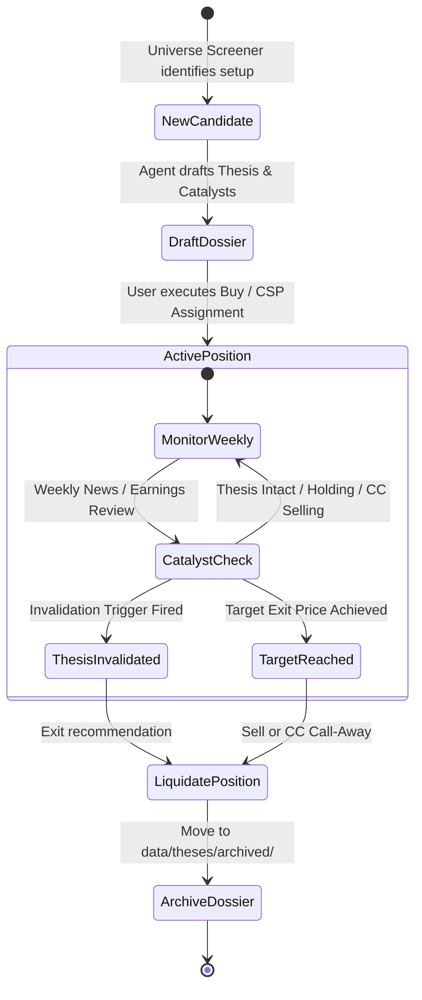

# Investment Thesis & Memory System

This document specifies the persistent memory architecture that prevents agent amnesia, maintains research continuity across weekly runs, and tracks catalyst progression for every portfolio holding.

## Why Persistent Memory Matters

Standard AI models evaluate portfolios in a vacuum each session. Without persistent memory:
- They forget *why* a position was purchased.
- They cannot tell if a recent event (like a dip after earnings) is a buying opportunity or a catastrophic thesis failure.
- They lack accountability for original price targets, expected holding periods, and target annualized ROIs.

This repository uses **Structured Markdown Dossiers** stored in `data/theses/<TICKER>.md` to maintain persistent, human-readable, and machine-parsable memory across weeks.

## Memory Store Structure

```
data/
└── theses/
    ├── EXAMPLE_THESIS.md       # Reference schema template
    ├── AAPL.md                 # Active dossier for Apple Inc.
    ├── BA.md                   # Active dossier for Boeing Co.
    └── archived/               # Dossiers of fully liquidated / exited positions
```

## Markdown Dossier Schema Specification

Every active position in the portfolio must have a corresponding file named `<TICKER>.md` in `data/theses/` adhering to the following structure:

```markdown
# Investment Thesis Dossier: [TICKER] - [Company Full Name]

## Summary & Key Metrics
- **Ticker:** [TICKER]
- **Exchange:** [NYSE / NASDAQ / AMEX]
- **Entry Date:** [YYYY-MM-DD]
- **Cost Basis:** $[X.XX] per share
- **Current Shares Owned:** [N]
- **Target Exit Price:** $[Y.YY]
- **Expected Holding Period:** [e.g., 6 Months / 2 Years / 5 Years]
- **Target Annualized ROI:** [e.g., 18.5%]
- **Status:** [ACTIVE_ACCUMULATING / ACTIVE_HOLDING / COVERED_CALL_ACTIVE / WATCH_FOR_EXIT]

## Core Investment Thesis
[Detailed narrative explaining why this company was chosen. Describe competitive advantages, economic moats, market tailwinds, or cyclical recovery dynamics.]

## Anticipated Catalyst Timeline
| Target Date / Window | Event / Catalyst | Expected Outcome | Actual Outcome & Impact | Status |
| :--- | :--- | :--- | :--- | :--- |
| YYYY-Q[N] | Q[N] Earnings Release | Revenue > $X, EPS > $Y, margin expansion | [Logged upon occurrence] | [PENDING / MET / MISSED] |
| YYYY-MM-DD | Product / Regulatory Milestone | Certification / FDA approval / product launch | [Logged upon occurrence] | [PENDING / MET / MISSED] |
| YYYY-MM-DD | Macro / Industry Event | Fed rate cut / contract win / debt refinancing | [Logged upon occurrence] | [PENDING / MET / MISSED] |

## Explicit Invalidation Criteria (Exit Triggers)
If any of the following conditions occur, the thesis is declared **broken** and the Thesis & Memory Agent will recommend immediate liquidation or aggressive covered call exit:
1. **Financial Failure:** [e.g., Revenue drops > 15% YoY or gross margins compress below 40%]
2. **Operational Failure:** [e.g., Delay in new aircraft FAA certification past Q4 2027]
3. **Governance / Capital Allocation:** [e.g., Dilutive secondary offering > 10% or unexpected dividend cut]
4. **Structural Change:** [e.g., Loss of major anchor customer representing > 20% of revenue]

## Thesis Log & Weekly Updates
### [YYYY-MM-DD] - Weekly Review
- **Price Action & Trend:** [Brief summary of weekly movement]
- **New Information / News:** [Earnings release, 10-Q filing, news event]
- **Catalyst Check:** [Did an event occur? Did it meet expectations?]
- **Thesis Assessment:** [INTACT / STRENGTHENED / UNDER_REVIEW / BROKEN]
- **Agent Action Recommendation:** [HOLD / SELL_CSP_AT_$X / SELL_CC_AT_$Y / LIQUIDATE]
```

## Thesis Lifecycle Workflow



## The Role of the Thesis & Memory Agent

During the weekend planning cycle, the `Thesis & Memory Agent` performs the following steps:
1. **Reads all files in `data/theses/`** matching active positions parsed by the `Portfolio Ingestion Agent`.
2. **Validates Catalyst Milestones:** Gathers recent news, SEC 10-K/10-Q filings, and earnings transcripts to check if scheduled catalysts were met or missed.
3. **Enforces Invalidation Discipline:** If an invalidation trigger is hit, the agent actively resists the "sunk cost fallacy" and proposes an orderly exit plan (direct limit sell or aggressive ATM/ITM covered call).
4. **Generates Updates:** Automatically drafts the weekly thesis log entry for each holding.
