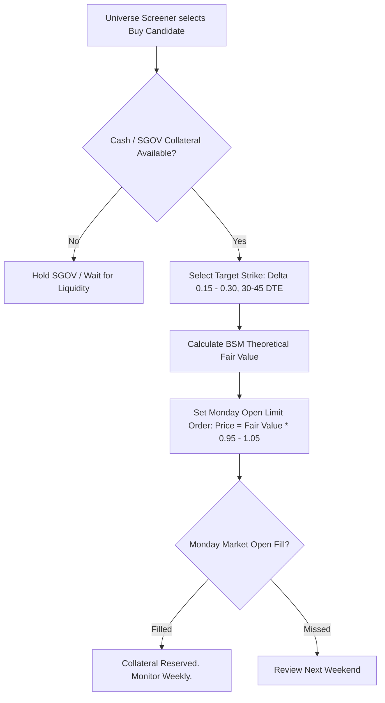

# Option Pricing & Strategies Guide

This document details the options modeling methodology, theoretical pricing formulas, and strategy execution rules for the **Derivatives & Limit Pricing Specialist Agent**. 

Because weekly portfolio analysis takes place over the weekend when exchanges are closed, the agent models option values mathematically to generate precise, executable **Limit Orders** for Monday morning market open.

---

## 🎯 Core Strategy Objectives

Options are used exclusively to:
1. **Acquire Quality Equities at a Discount:** Selling Cash-Secured Puts (CSPs) at strikes below current market prices to either acquire high-conviction shares at an attractive cost basis or collect cash yield.
2. **Harvest Yield on Existing Shares:** Selling Covered Calls (CCs) on long positions ($\ge 100$ shares) at strikes aligned with price targets to earn premium or exit at target valuations.
3. **Defend & Extend Positions:** Rolling options (out in time and down/up in strike) for net credits when market volatility tests open strikes.

> [!CAUTION]
> **Zero Naked Options Policy:** Naked puts and naked calls are strictly forbidden. All puts must have 100% cash/SGOV collateral; all calls must be backed by $\ge 100$ long shares.

---

## 🧮 1. Weekend Theoretical Option Pricing Modeling

Over the weekend, bid/ask quotes are static or wide. The agent calculates the **Theoretical Fair Value** using the Black-Scholes-Merton (BSM) formulation adjusted for dividends:

### Black-Scholes-Merton Formulation

For a stock price $S$, strike price $K$, risk-free rate $r$ (approximated by 3-month Treasury / SGOV yield), dividend yield $q$, time to expiration $T$ (in years), and volatility $\sigma$:

$$d_1 = \frac{\ln(S / K) + \left(r - q + \frac{\sigma^2}{2}\right) T}{\sigma \sqrt{T}}$$

$$d_2 = d_1 - \sigma \sqrt{T}$$

$$\text{Call Price } C = S e^{-q T} N(d_1) - K e^{-r T} N(d_2)$$

$$\text{Put Price } P = K e^{-r T} N(-d_2) - S e^{-q T} N(-d_1)$$

Where $N(x)$ is the cumulative standard normal distribution function.

### Implied Volatility (IV) Estimation Over the Weekend
To parameterize $\sigma$ accurately without live chain feeds:
1. **Historical Realized Volatility (HV):** Calculate 30-day and 90-day annualized realized volatility of daily close-to-close returns:
   $$\sigma_{\text{realized}} = \sqrt{252} \times \text{std}(\ln(S_t / S_{t-1}))$$
2. **IV/HV Premium Multiplier:** In public equity markets, implied volatility typically trades at a historical premium ($1.10\times$ to $1.25\times$) over realized volatility (the Volatility Risk Premium).
3. **Earnings / Event IV Crush:** If an earnings catalyst occurs prior to expiration $T$, adjust $\sigma$ upward to reflect pre-earnings event premium.

---

## 📝 2. Cash-Secured Put (CSP) Execution Framework

### Strike & Expiration Selection Criteria
- **Days to Expiration (DTE):** $30\text{ to }45$ days. (Captures the steepest phase of theta decay while providing adequate premium).
- **Target Delta:** $-0.15\text{ to }-0.30$ (Probability of expiring OTM $\approx 70\%\text{--}85\%$).
- **Collateral Backing:** Must have $\text{Strike} \times 100$ in unallocated cash or liquid `SGOV`.
- **Target Annualized Return on Collateral (ROC):**
  $$\text{Annualized ROC} = \left(\frac{\text{Premium}}{\text{Strike} \times 100}\right) \times \left(\frac{365}{\text{DTE}}\right) \times 100\%$$
  - Target: $\ge 12\%\text{--}20\%$ annualized ROC.

---

## 📈 3. Covered Call (CC) Execution Framework

### Criteria for Selling Calls
- **Eligibility:** Position must hold at least **100 shares** (or multiples of 100).
- **Strike Selection:**
  - Strike must be $\ge \text{Cost Basis}$ (to guarantee capital gain on assignment).
  - Strike should be aligned with the **Target Exit Price** established in the markdown dossier (`data/theses/<TICKER>.md`).
- **Target Delta:** $+0.20\text{ to }+0.35$ with $30\text{--}45$ DTE.
- **Assignment Acceptance:** If the stock rallies past the strike at expiration, the shares are called away at the target price, achieving the thesis objective and freeing capital for new opportunities.

---

## 🔄 4. Option Rolling Rules

When an existing option position approaches expiration ($< 14$ DTE) or becomes tested:

### Rolling Cash-Secured Puts (Defense)
- **When to Roll:** Underlying stock drops below or near the short put strike, but the core investment thesis remains **INTACT**.
- **Action:** Buy back the near-term put and sell a new put with longer DTE ($+30\text{ to }45$ days) and lower strike.
- **Rule:** The roll must generate a **Net Credit** or breakeven debit to continuously lower the effective cost basis.

### Rolling Covered Calls (Offense / Yield Extension)
- **When to Roll:** Underlying stock rallies strongly past the call strike, and the thesis suggests substantial further upside before reaching fair value.
- **Action:** Buy back the near-term call and sell a further-out expiration at a higher strike for a net credit.

---

## 📋 5. Monday Limit Order Calculation Matrix

To prevent market order slippage and ensure disciplined execution, the agent outputs an explicit **Monday Limit Order Sheet**:

| Action | Ticker | Contract / Lot | Expiration Date | Strike Price | Modeled Fair Value | Monday Limit Price | Sizing / Collateral | Purpose |
| :--- | :--- | :--- | :--- | :--- | :--- | :--- | :--- | :--- |
| **SELL TO OPEN** | `INTC` | 2x Put (CSP) | 2026-09-25 (41 DTE) | $20.00 | $0.85 | **$0.80 Limit** | $4,000 Cash / SGOV | Buy target at discount / 18.2% ROC |
| **SELL TO OPEN** | `BA` | 2x Call (CC) | 2026-09-25 (41 DTE) | $210.00 | $3.40 | **$3.30 Limit** | 200 BA shares owned | Harvest yield toward $265 target |
| **ROLL** | `XYZ` | 1x Put | Oct 17 $\rightarrow$ Nov 21 | $50 \rightarrow $47.50 | Net Credit $0.45 | **Net Credit $0.40 Limit** | $4,750 Collateral | Roll out & down to lower cost basis |
